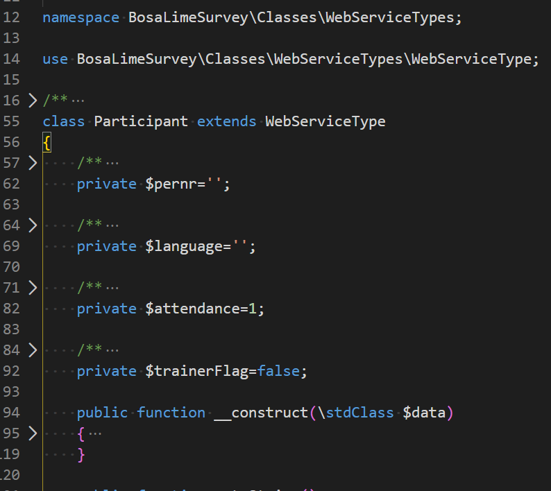

# Visual Studio Code Tip -  Some extensions

* [Raccourci clavier](#raccourci-clavier)
* [Retrouver la liste des extensions installées](#retrouver-la-liste-des-extensions-install%c3%a9es)
* [Quelques extensions](#quelques-extensions)
  * [Active File In StatusBar](#active-file-in-statusbar)
  * [Apache Conf](#apache-conf)
  * [Autofold](#autofold)
  * [Better comments](#better-comments)
  * [Bookmarks](#bookmarks)
  * [Bracket Pair Colorizer](#bracket-pair-colorizer)
  * [Code Spell Checker](#code-spell-checker)
  * [ESLint](#eslint)
  * [Favorites](#favorites)
  * [Laravel Blade Snippets](#laravel-blade-snippets)
  * [Log File Highlighter](#log-file-highlighter)
  * [Markdown All in One](#markdown-all-in-one)
  * [Markdownlint](#markdownlint)
  * [PHP-CS-FIXER](#php-cs-fixer)
  * [PHP DocBlocker](#php-docblocker)
  * [PHP Extension Pack](#php-extension-pack)
  * [PHP Intelephense](#php-intelephense)
  * [PHP IntelliSense](#php-intellisense)
  * [Prettier](#prettier)
  * [Project Manager](#project-manager)
  * [Select highlight in minimap](#select-highlight-in-minimap)
  * [Sort lines](#sort-lines)
  * [Syncing](#syncing)
  * [Todo Tree](#todo-tree)
  * [vscode-icons](#vscode-icons)
  * [Surround](#surround)

## Raccourci clavier

<kbd>CTRL</kbd>-<kbd>ALT</kbd>-<kbd>X</kbd> pour afficher le panneau des extensions.

## Retrouver la liste des extensions installées

Cliquer sur le bouton pour afficher les extensions et faire une recherche sur `@installed` comme ci-dessous illustré :

## Quelques extensions

### Active File In StatusBar

> [https://marketplace.visualstudio.com/items?itemName=RoscoP.ActiveFileInStatusBar](https://marketplace.visualstudio.com/items?itemName=RoscoP.ActiveFileInStatusBar)

Affiche le nom complet du fichier en cours d'édition au bas de l'écran et permet, p.ex., de copier/coller son nom en cliquant sur celui-ci

### Apache Conf

> [https://marketplace.visualstudio.com/items?itemName=mrmlnc.vscode-apache](https://marketplace.visualstudio.com/items?itemName=mrmlnc.vscode-apache)

Support (coloration) des fichiers Apache tels que .htaccess, .htpasswd, .conf et .htgroups

### Autofold

> [https://marketplace.visualstudio.com/items?itemName=bobmagicii.autofoldyeah](https://marketplace.visualstudio.com/items?itemName=bobmagicii.autofoldyeah)

By opening a file, the autofold extension will automatically collapse docblocks, functions, ...

The level (collapse all, from the second, third, ... level) can be configured for each file extension separately.
Here is a sample : by opening that source file, comment’s and function’s code is collapse automatically, we’ve directly a better view on what that file is doing.

### Better comments

> [https://marketplace.visualstudio.com/items?itemName=aaron-bond.better-comments](https://marketplace.visualstudio.com/items?itemName=aaron-bond.better-comments)

The Better Comments extension will help you create more human-friendly comments in your code.

### Bookmarks

> [https://marketplace.visualstudio.com/items?itemName=alefragnani.Bookmarks](https://marketplace.visualstudio.com/items?itemName=alefragnani.Bookmarks)

Permet de mettre des fichiers dans un dossier Bookmark, afficher dans la barre d'icônes à gauche. Cela permet surtout de sauter très rapidement dans un fichier, à une ligne précise (qui aurait été bookmarkée)

### Bracket Pair Colorizer

> [https://marketplace.visualstudio.com/items?itemName=CoenraadS.bracket-pair-colorizer](https://marketplace.visualstudio.com/items?itemName=CoenraadS.bracket-pair-colorizer)

Utilise différentes couleurs dans l'éditeur pour bien identifier les parenthèses et les accolades d'ouverture / fermeture.

### Code Spell Checker

> [https://marketplace.visualstudio.com/items?itemName=streetsidesoftware.code-spell-checker](https://marketplace.visualstudio.com/items?itemName=streetsidesoftware.code-spell-checker)

### ESLint

> [https://marketplace.visualstudio.com/items?itemName=dbaeumer.vscode-eslint](https://marketplace.visualstudio.com/items?itemName=dbaeumer.vscode-eslint)

Linter pour JavaScript

### Favorites

> [https://marketplace.visualstudio.com/items?itemName=kdcro101.favorites](https://marketplace.visualstudio.com/items?itemName=kdcro101.favorites)

Permet de regrouper des raccourcis vers des fichiers que, p.ex., on doit souvent ouvrir.

### Laravel Blade Snippets

> [https://marketplace.visualstudio.com/items?itemName=onecentlin.laravel-blade](https://marketplace.visualstudio.com/items?itemName=onecentlin.laravel-blade)

Helper for working with Laravel Blade templates

### Log File Highlighter

> [https://marketplace.visualstudio.com/items?itemName=emilast.LogFileHighlighter](https://marketplace.visualstudio.com/items?itemName=emilast.LogFileHighlighter)

Coloration de fichiers log

### Markdown All in One

> [https://marketplace.visualstudio.com/items?itemName=yzhang.markdown-all-in-one](https://marketplace.visualstudio.com/items?itemName=yzhang.markdown-all-in-one)

Implémente des raccourcis clavier pour le langage Markdown, permet la génération de tables des matières, prévisualisation, ...

### Markdownlint

> [https://marketplace.visualstudio.com/items?itemName=DavidAnson.vscode-markdownlint](https://marketplace.visualstudio.com/items?itemName=DavidAnson.vscode-markdownlint)

Linter pour Markdown, vérifie la qualité de la syntaxe et notifie des éventuels problèmes

markdownlint allow to ignore specific rules on a file-basis; see [https://github.com/DavidAnson/markdownlint#configuration](https://github.com/DavidAnson/markdownlint#configuration) for more information.

### PHP-CS-FIXER

> [https://marketplace.visualstudio.com/items?itemName=junstyle.php-cs-fixer](https://marketplace.visualstudio.com/items?itemName=junstyle.php-cs-fixer)

Correction automatique de la qualité de la mise en forme du code PHP grâce à des normes de qualité (p.ex. PSR2), surchargeables au travers d'un fichier de configuration.

### PHP DocBlocker

> [https://marketplace.visualstudio.com/items?itemName=neilbrayfield.php-docblocker](https://marketplace.visualstudio.com/items?itemName=neilbrayfield.php-docblocker)

Permet de générer des blocs de documentation des classes, méthodes, ...

### PHP Extension Pack

> [https://marketplace.visualstudio.com/items?itemName=felixfbecker.php-pack](https://marketplace.visualstudio.com/items?itemName=felixfbecker.php-pack)

### PHP Intelephense

> [https://marketplace.visualstudio.com/items?itemName=bmewburn.vscode-intelephense-client](https://marketplace.visualstudio.com/items?itemName=bmewburn.vscode-intelephense-client)

### PHP IntelliSense

> [(<https://marketplace.visualstudio.com/items?itemName=felixfbecker.php-intellisense)]https://marketplace.visualstudio.com/items?itemName=felixfbecker.php-intellisense>

### Prettier

> [https://marketplace.visualstudio.com/items?itemName=esbenp.prettier-vscode](https://marketplace.visualstudio.com/items?itemName=esbenp.prettier-vscode)

Corrige la qualité de la mise en page du code.

### Project Manager

> [https://marketplace.visualstudio.com/items?itemName=alefragnani.project-manager](https://marketplace.visualstudio.com/items?itemName=alefragnani.project-manager)

Permet de définir ses projets, de spécifier où ils se trouvent sur le disque et de rapidement passer de l'un à l'autre.

### Select highlight in minimap

> [https://marketplace.visualstudio.com/items?itemName=mde.select-highlight-minimap](https://marketplace.visualstudio.com/items?itemName=mde.select-highlight-minimap)

Surligne le code sélectionné (p.ex. un nom de fonction) dans la minimap afin qu'on puisse rapidement identifier où, dans le fichier en cours d'édition, cette même fonction est appelée.

### Sort lines

> [https://marketplace.visualstudio.com/items?itemName=Tyriar.sort-lines](https://marketplace.visualstudio.com/items?itemName=Tyriar.sort-lines)

Petit utilitaire permettant de trier des lignes dans un fichier.

### Syncing

> [https://marketplace.visualstudio.com/items?itemName=nonoroazoro.syncing](https://marketplace.visualstudio.com/items?itemName=nonoroazoro.syncing)

Ajoute des fonctionnalités de synchronisation des paramètres de l'éditeur, la liste des extensions installées, ... dans le cloud (sur un gist) afin de pouvoir synchroniser différentes machines et garder une même configuration.

### Todo Tree

> [https://marketplace.visualstudio.com/items?itemName=Gruntfuggly.todo-tree](https://marketplace.visualstudio.com/items?itemName=Gruntfuggly.todo-tree)

Affiche une icône à la gauche de l'écran, sous la forme d'un arbre, et qui permet de retrouver, en un seul lieu, la liste des TODO qu'on doit faire c-à-d des commentaires débutant par `// TODO` qui ont été encodés dans les fichiers sources.

### vscode-icons

> [https://marketplace.visualstudio.com/items?itemName=robertohuertasm.vscode-icons](https://marketplace.visualstudio.com/items?itemName=robertohuertasm.vscode-icons)

Adapte le treeview avec la liste des fichiers pour utiliser une icône associée au type de fichier (css, html, php, ...)

### Surround

> [https://marketplace.visualstudio.com/items?itemName=yatki.vscode-surround](https://marketplace.visualstudio.com/items?itemName=yatki.vscode-surround)

On sélectionne un bloc de lignes de code puis, grâce à Surround, on peut l'inclure dans un `if/else`, `try/catch`, ... L'outil fait lui-même l'indentation du code.

