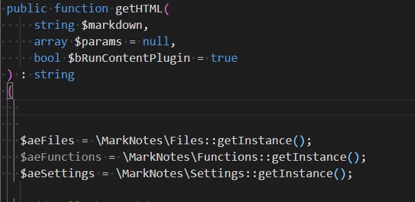

# Snippets {#snippets}

## Global {#snippets-global}

### Built-in {#snippets-built-in}

Snippets are pieces of pre-programmed code (like a `try...catch...`) that allow you to generate code without typing it entirely.

Depending on the open file and its language (php, js, markdown, ...), *VSCode* will offer standard snippets and it will also be possible to program your own.

Press <kbd>CTRL</kbd>-<kbd>SHIFT</kbd>-<kbd>P</kbd> to open the Palette Command then type `Insert Snippet` to get the list of already existing snippets.

### User-defined ones {#snippets-user-defined}

It is however, possible to write your own snippets: press <kbd>CTRL</kbd>-<kbd>SHIFT</kbd>-<kbd>P</kbd> then `Configure User Snippets`. The programming language is chosen, e.g. `PHP`, which will open an editor with, here, the open `PHP` file.

A file called `php.json` will be open and you can start to create a snippet; f.i.:

```json
<!-- concat-md::include "./files/strict.json" -->
```

The code here above defines a snippet called `strict` and it's for a `.php` file. Open such file, start to type `stri` (you can type only a few letters) and press the <kbd>CTRL</kbd>-<kbd>space</kbd> keys. Select the snippet and press <kbd>enter</kbd>. You'll get the code defined in the `body`. It's magic.

Note: you can also desire to just press the <kbd>TAB</kbd> key. If so, check your `User Settings` and make sure the following key is well on `on`:

```json
<!-- concat-md::include "./files/tabCompletion.json" -->
```

The example below will add two snippets, one called `img` and the other one `url`. These snippets are for markdown files so, when adding snippets to VSCode, in the `Configure User Snippets` command, select `markdown` as language first.

```json
<!-- concat-md::include "./files/markdown.json" -->
```

### Make snippets configurable {#snippets-user-placeholders}

Take a look on the following snippet and the `$1` and `$2` placeholders.

```json
<!-- concat-md::include "./files/vd.json" -->
```

Save this snippet in your editor and, in a `php` file, type `vd` followed by <kbd>CTRL</kbd>-<kbd>space</kbd>. You'll get now three new lines and the cursor will be placed where the `$1` placeholder was. Type a PHP variable and press <kbd>TAB</kbd> and see, the cursor will be now immediately put where `$2` was located. Thanks these placeholders it's easy to foresee, in a snippet, locations where you need to type dynamic content like variables, custom text, ...

Tip: use `${1:$variableName}` instead of just `$1` to show a place holder and/or a default value.



### Using variables

When creating a snippet, we can f.i. use the current PHP filename. Imagine you've a file name `Customer.php` and there you wish to create a new class.

The following snippet will do the magic:

```json
<!-- concat-md::include "./files/newclass.json" -->
```

The `TM_FILENAME_BASE` variable will be replaced by VS Code to the filename *(without the extension)* so we'll get a new class called `Customer`.

See all variables here: [https://code.visualstudio.com/docs/editor/userdefinedsnippets#_variables](https://code.visualstudio.com/docs/editor/userdefinedsnippets#_variables)

### Settings {#snippets-settings}

User snippets are stored in the `%APPDATA%\code\user\snippets` folder, one `.json` file by languages.

### Extensions {#snippets-extensions}

Also see the [snippet-creator](#extensions-snippet-creator) extension.

## Project-based {#snippets-project-based}

You can also define your snippets for your project and not globally. You can then share snippets with your colleagues f.i.

1. In the root folder of your project create a `.vscode` folder if not yet present;
2. Create a file with the `.code-snippets` extension like `my-project.code-snippets`;
3. You can configure your snippets there.

Below an example from this `VSCode-Tips` project:

```json
<!-- concat-md::include "./files/project-based.json" -->
```

Now, each time I'll type `terminal` I can decide to immediately add the keyboard shortcuts; nice.

## Generator {#snippets-generator}

If you prefer to use a generator, [https://snippet-generator.app/](https://snippet-generator.app/) can help you.

## Video tutorial {#snippets-video}

[https://www.youtube.com/watch?v=JIqk9UxgKEc](https://www.youtube.com/watch?v=JIqk9UxgKEc)
