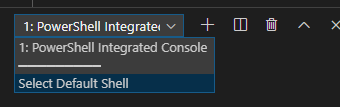

# Using the built-in terminal {#terminal}

Press <kbd>CTRL</kbd>-<kbd>SHIFT</kbd>-<kbd>ù</kbd> to open the built-in terminal.

Press <kbd>CTRL</kbd>-<kbd>SHIFT</kbd>-<kbd>C</kbd> to open a DOS Prompt session where the current folder will be the opened project.

You can choose for a DOS terminal, Powershell or bash one. Just select the `Select Default Shell` option and VS Code will prompt which shell application should be used.

Note: by clicking on the `+` button, we can create as many terminals we want.

## Extensions {#terminal-extensions}

Also see the [Rerun last command](#extensions-terminal-rerun) extension.
