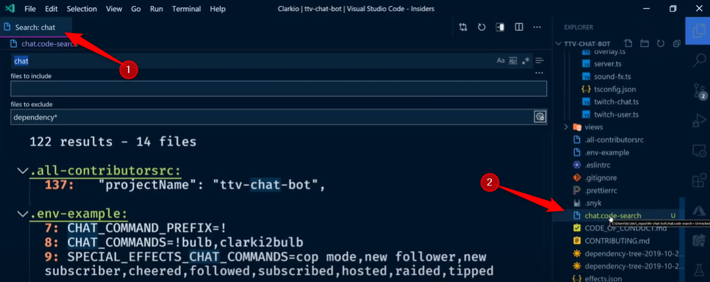

# Search

## Save the search

Just after having fired a search, it's possible to click on the `Open in editor` link so the result appears in the editor. The very nice thing then is to be able to see the context (i.e. xxx lines before/after the search match) and to be able to save the search as a file (the filename will be `.code-search`).

This can be useful when f.i. the search pattern is a complex regex or if working on the search result can take a long time so we can save the search as a file in the project and open it later on.

This video show this: [https://www.youtube.com/watch?v=zm7ZjENKUEc](https://www.youtube.com/watch?v=zm7ZjENKUEc)
