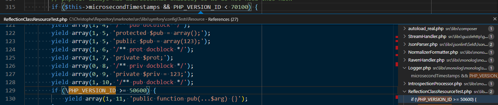

# Code definition

By right-clicking on a variable, constant or method, we can get access to a few features like showing everywhere it's used.

* <kbd>SHIFT</kbd>-<kbd>F12</kbd> to show all references

In the right area of the popup, we can navigate and click to see each portion of files.

Press <kbd>F12</kbd> to jump in the definition of the method: click or select a method name like in `writeLog(...)` and press <kbd>F12</kbd> once the cursor is located on `writeLog` and you'll jump in the file that implements the method, the method source code will be displayed too.
