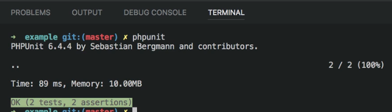

# PHP-Unit {#phpunit}

From the `Terminal` (<kbd>CTRL</kbd>-<kbd>SHIFT</kbd>-<kbd>ù</kbd>), you can directly run phpunit and the full suite of tests will be executed.

## Extensions {#phpunit-extensions}

Also see the [Better PHPUnit](#extensions-php-better-phpunit) extension.
