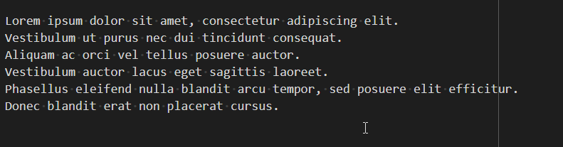

# Multiple cursors {#multiple-cursors}

VSCode supports multiple cursors: click here and there and there but just press the <kbd>CTRL</kbd> key after the first click.

You'll then have more than one cursor and starting type will do it in any places where a cursor was displayed.

For instance, you've a list of public functions, click before each `p` of public functions, press the delete key to remove the `public` word, it'll be done for all functions at a time and type now `private`.

You can also have an enumeration list, one word on each line. Click before each letter and then type `*` to add a bullet before each item.

Really convenient.

The <kbd>CTRL</kbd>-<kbd>D</kbd> shortcut will select the next occurrence: double-click on, f.i., the `public` word to select the first occurrence. Press <kbd>CTRL</kbd>-<kbd>D</kbd> to select the second, the third, and so on. Press <kbd>CTRL</kbd>-<kbd>D</kbd> again and again to select all occurrences. Then type `private` f.i. to overwrite selections and replace by the new word.

I's not really like a `Search` and `Replace all` since here we can decide how many occurrences we wish to replace. It's more interactive.

## Insert prefix on each line {#multiple-cursors-insert-prefix}

<kbd>SHIFT</kbd>-<kbd>ALT</kbd>-<kbd>I</kbd> allow to enable multiple cursors, a nice use case is to select a bloc of lines and add a bullet so transform lines to a bullet list.

Here is how to do:

1. Select a bloc a line
2. Press <kbd>SHIFT</kbd>-<kbd>ALT</kbd>-<kbd>I</kbd> to enable multiple cursors
3. Press <kbd>Home</kbd> to put cursors at the beginning of each lines,
4. Press <kbd>*</kbd> followed by a space to transform the list of lines to a bullet list.

