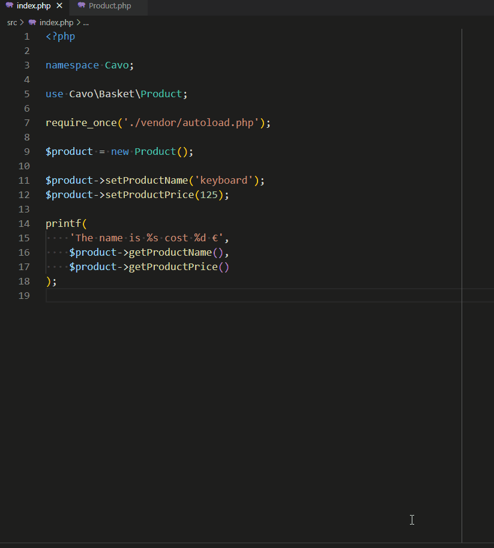
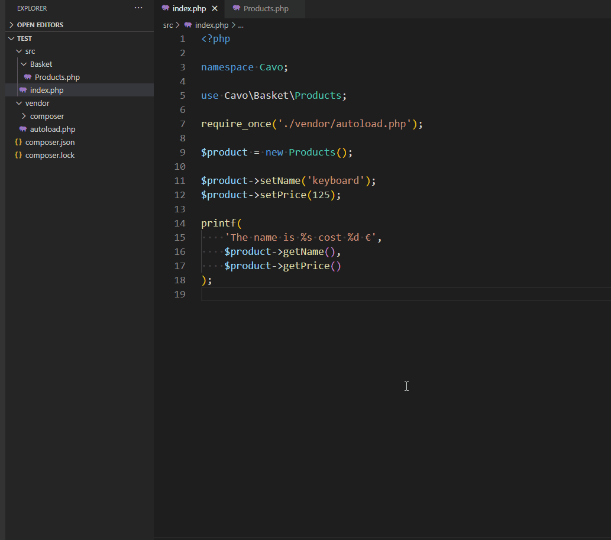

# Renaming

> https://marketplace.visualstudio.com/items?itemName=st-pham.php-refactor-tool

For PHP, for install the `PHP Refactor Tool` addon.

## a symbol

1. Select a property,
2. Press <kbd>F2</kbd> (or choose `Rename Symbol` in the Command palette (press <kbd>CTRL</kbd>-<kbd>SHIFT</kbd>-<kbd>P</kbd>))
3. Rename the property
4. Select `Update Getter name and Setter name`
5. Press <kbd>Enter</kbd>

Thanks to `PHP Refactor Tool`, all occurrences of the property will be renamed, the getter and the setter and everywhere these functions were used too. In all files of your project.

## a class

Anywhere in your code (in the class itself or where you use it), select the class name, press <kbd>F2</kbd>, rename it and press <kbd>Enter</kbd>.

The name will be changed everywhere, the name of the file will be changed too as you can see here below.

