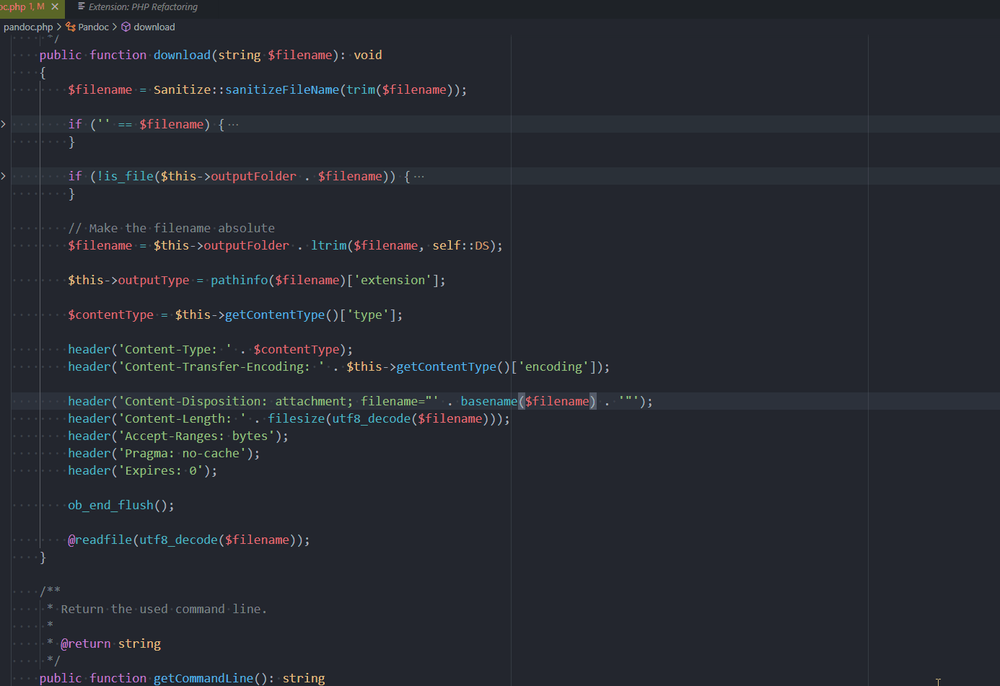

# Extract to a new method

> [https://marketplace.visualstudio.com/items?itemName=marsl.vscode-php-refactoring](https://marketplace.visualstudio.com/items?itemName=marsl.vscode-php-refactoring)

In a long method, select a block of lines, open the `Command Palette` and run `Extract to a new method`. Then give a name and press <kbd>Enter</kbd>. The method will be created and the extension will pass local variabled if needed to the new method and, if the method initialize a variable, that variable will be returned.

