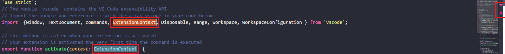

# Select highlight in minimap {#extensions-select-highlight-minimap}

> [https://marketplace.visualstudio.com/items?itemName=mde.select-highlight-minimap](https://marketplace.visualstudio.com/items?itemName=mde.select-highlight-minimap)

Highlights the selected code (e.g. a function name) in the minimap so that you can quickly identify where in the currently edited file the same function is called.

