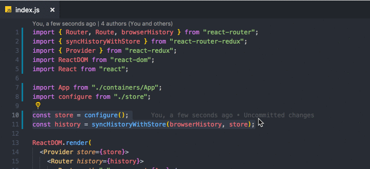

# Surround {#extensions-surround}

> [https://marketplace.visualstudio.com/items?itemName=yatki.vscode-surround](https://marketplace.visualstudio.com/items?itemName=yatki.vscode-surround)

On sélectionne un bloc de lignes de code puis, grâce à Surround, on peut l'inclure dans un `if/else`, `try/catch`, ... L'outil fait lui-même l'indentation du code.

