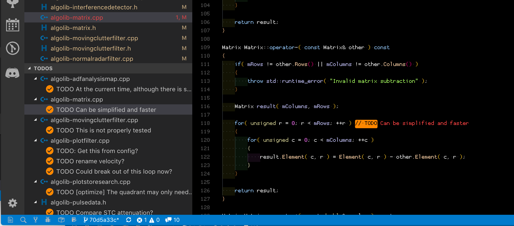

# Todo Tree {#extensions-todo-tree}

> [https://marketplace.visualstudio.com/items?itemName=Gruntfuggly.todo-tree](https://marketplace.visualstudio.com/items?itemName=Gruntfuggly.todo-tree)

Displays an icon on the left side of the screen, in the form of a tree, which allows you to find, in one place, the list of TODOs that you have to make, i.e. comments beginning with `// TODO` that have been encoded in the source files.

