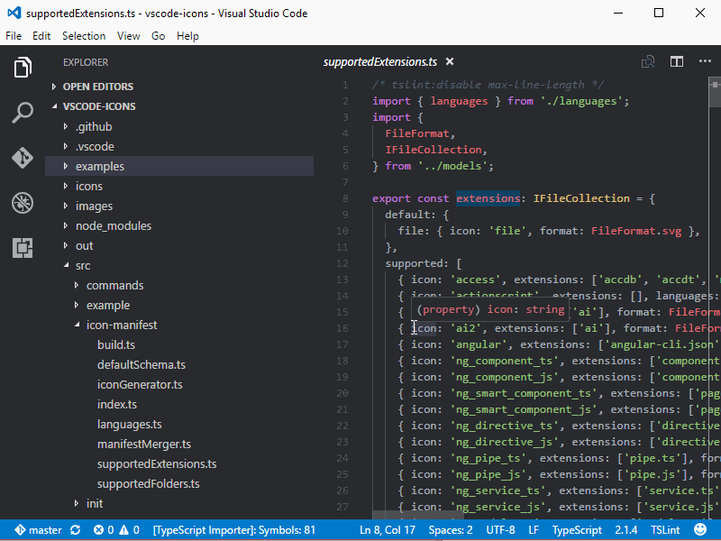

# vscode-icons {#extensions-vscode-icons}

> [https://marketplace.visualstudio.com/items?itemName=robertohuertasm.vscode-icons](https://marketplace.visualstudio.com/items?itemName=robertohuertasm.vscode-icons)

Adapt the tree-view with the list of files to use an icon associated to the type of file (css, html, php, ...)

