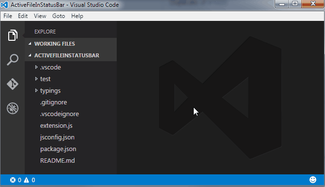

# Active File In StatusBar {#extensions-active-file-statusbar}

> [https://marketplace.visualstudio.com/items?itemName=RoscoP.ActiveFileInStatusBar](https://marketplace.visualstudio.com/items?itemName=RoscoP.ActiveFileInStatusBar)

Displays the full name of the file being edited at the bottom of the screen and allows, for example, to copy/paste its name by clicking on it.

