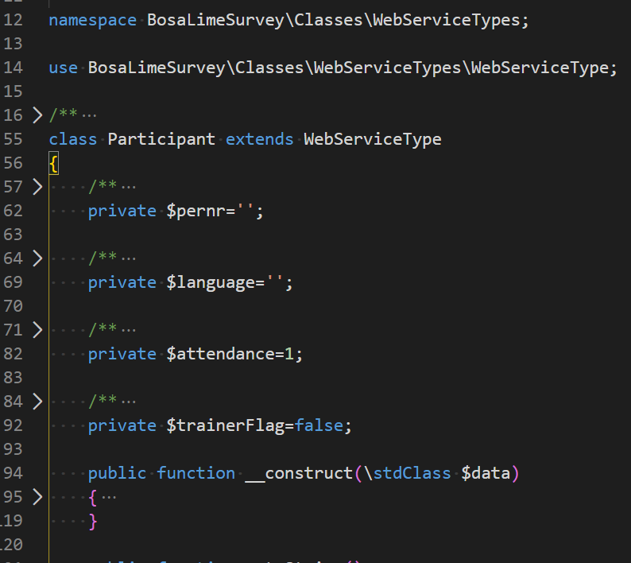

# Autofold {#extensions-autofold}

> [https://marketplace.visualstudio.com/items?itemName=bobmagicii.autofoldyeah](https://marketplace.visualstudio.com/items?itemName=bobmagicii.autofoldyeah)

By opening a file, the autofold extension can automatically collapse docblocks, functions, ...

The level (collapse all, from the second, third, ... level) can be configured for each file extension separately.

Here is a sample: by opening that source file, comments and function code is collapsing automatically, we've directly a better view on what that file is doing.

