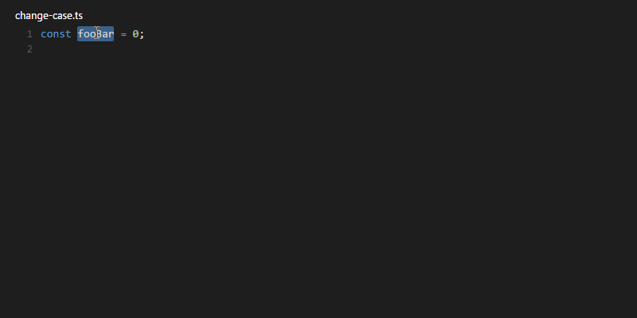

# Change case {#extensions-change-case}

> [https://marketplace.visualstudio.com/items?itemName=wmaurer.change-case](https://marketplace.visualstudio.com/items?itemName=wmaurer.change-case)

Easily change the case of variable names; like switching to pascal case, camelCase, CONSTANT, ...

