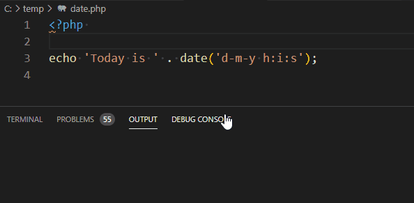

# Code runner {#extension-code-runner}

> [https://marketplace.visualstudio.com/items?itemName=formulahendry.code-runner](https://marketplace.visualstudio.com/items?itemName=formulahendry.code-runner)

With Code runner, open a supported code source (like PHP or Python) and press  <kbd>CTRL</kbd>-<kbd>SHIFT</kbd>-<kbd>R</kbd> to run that code and get the result in the console. You even don't need to save the file.

