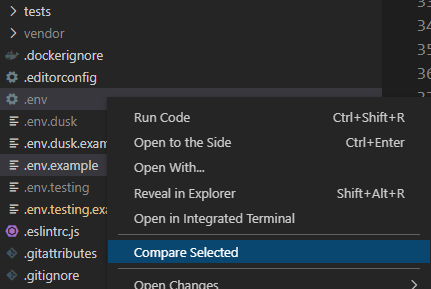

# Compare Folders {#extensions-compare-folders}

> [https://marketplace.visualstudio.com/items?itemName=moshfeu.compare-folders](https://marketplace.visualstudio.com/items?itemName=moshfeu.compare-folders)

You'll not need `winMerge` (Windows) anymore.

Just select the two files (or folders) you want to compare, make a right click on a file and select `Compare Selected`.

