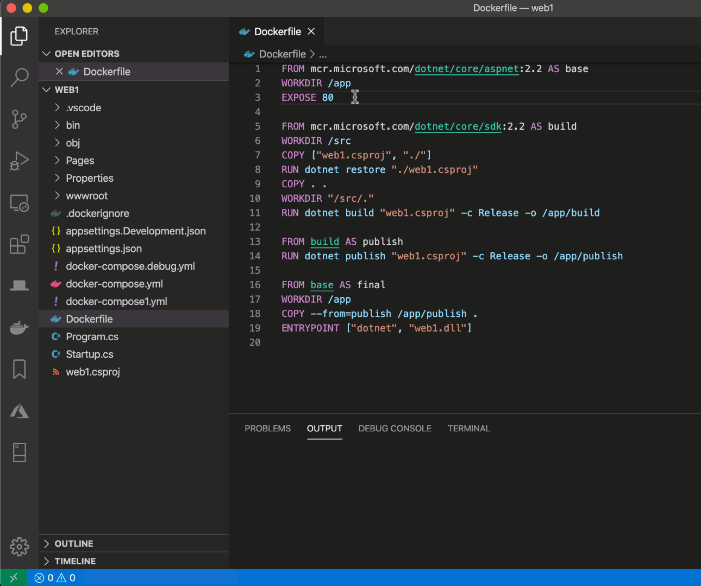

# Docker {#docker}

> [https://marketplace.visualstudio.com/items?itemName=ms-azuretools.vscode-docker](https://marketplace.visualstudio.com/items?itemName=ms-azuretools.vscode-docker)

Microsoft extension for Docker that will make working with Docker easier.

You'll get a new button in the left navigation sidebar to see a lot of features like getting the list of running containers (with start / stop / remove actions), the list of images, the list of volumes, ...

You'll also get linting feature for files like `Dockerfile` or `docker-compose.yml` and many more.
