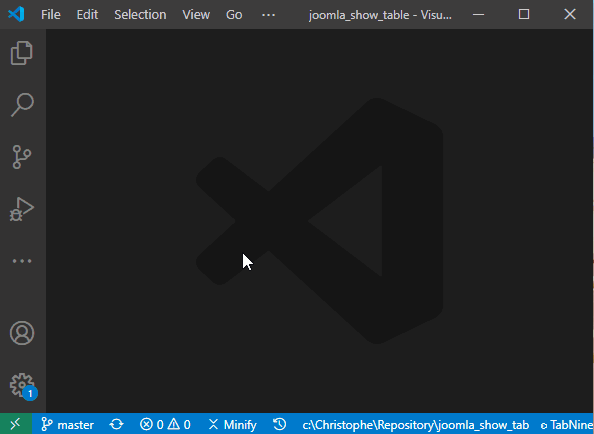

# git-project-manager {#extensions-git-project-manager}

> [https://github.com/felipecaputo/git-project-manager](https://github.com/felipecaputo/git-project-manager)

A Git Project Manager extension for vsCode.

Using GPM, it's now really easy to open a project: just press <kbd>CTRL</kbd>-<kbd>P</kbd> to open the Command Palette and select `GPM: Open Git Project`. Then you'll get the list of all folders on your disk with Git repositories.

First, you'll need to configure the `gitProjectManager.baseProjectsFolders` setting with the list of directories with your project; let's say `C:\Christophe\Repository`. You can mention several folders if you desire to.

You can also specify a root folder and playing with the `gitProjectManager.maxDepthRecursion` setting, you can define the recursion (*the higher the number, the slower the system will be to retrieve the list of projects*).

```json
<!-- concat-md::include "./files/settings.json" -->
```


