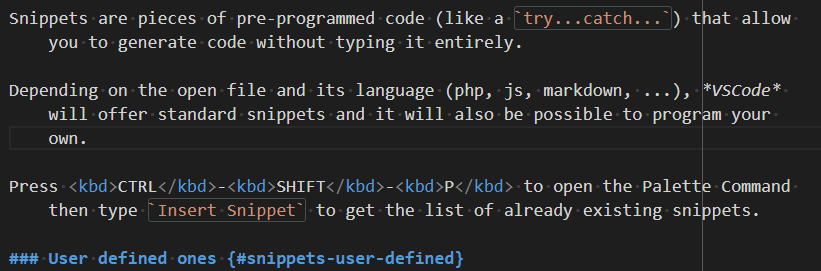

# Vscode Google Translate {#extensions-google-translate}

> [https://marketplace.visualstudio.com/items?itemName=funkyremi.vscode-google-translate](https://marketplace.visualstudio.com/items?itemName=funkyremi.vscode-google-translate)

Quickly translate text right in your code.



## Configuration Google Translate

By setting your preferred language, you'll not be prompted each time about the target language.

```json
<!-- concat-md::include "./files/settings.json" -->
```

Also, it's best to assign keyboard shortcut like <kbd>ALT</kbd>-<kbd>SHIFT</kbd>-<kbd>T</kbd> to translate the text.

```json
<!-- concat-md::include "./files/shortcut.json" -->
```
