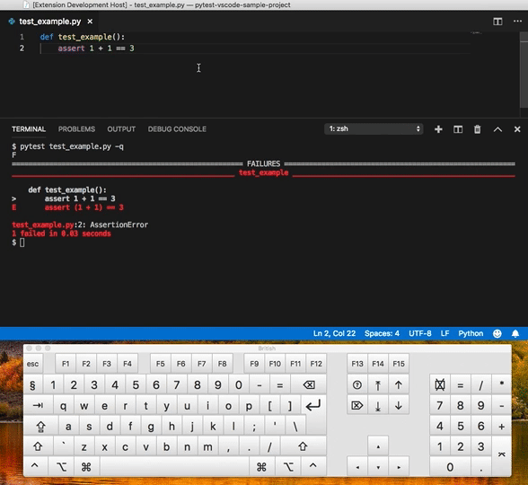

# Rerun the last command {#extensions-terminal-rerun}

[https://marketplace.visualstudio.com/items?itemName=Cameron.rerun-last-command](https://marketplace.visualstudio.com/items?itemName=Cameron.rerun-last-command)

Quickly repeat the last command in your terminal without leaving the text editor.

Just press <kbd>CTRL</kbd>-<kbd>F7</kbd> to rerun it.

