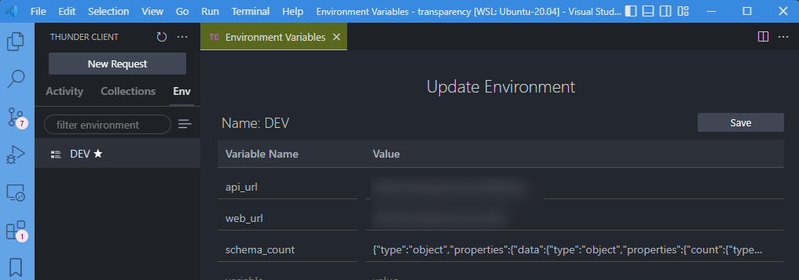
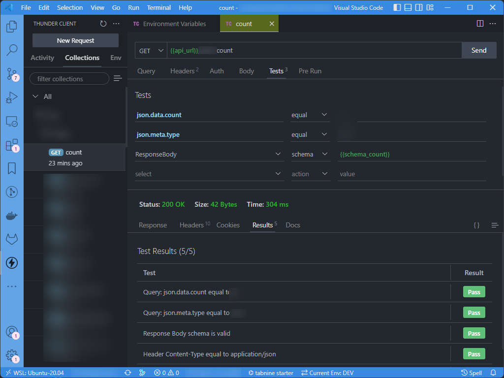

# Validate an API against a schema using Thunder Client

Imagine you have an API "How many employees are working in my company" and returning something like this:

```json
{
  "data": {
    "count": 6
  },
  "meta": {
    "type": "employees"
  }
}
```

You can easily generate a JSON schema using [https://www.liquid-technologies.com/online-json-to-schema-converter](https://www.liquid-technologies.com/online-json-to-schema-converter). Just copy/paste your JSON response.

You'll get a JSON response and remove the first line with `$schema`, so, you'll have:

```json
{
  "type": "object",
  "properties": {
    "data": {
      "type": "object",
      "properties": {
        "count": {
          "type": "integer"
        }
      },
      "required": [
        "count"
      ]
    },
    "meta": {
      "type": "object",
      "properties": {
        "type": {
          "type": "string"
        }
      },
      "required": [
        "type"
      ]
    }
  },
  "required": [
    "data",
    "meta"
  ]
}
```

Not so difficult to understand: we have two root level nodes, one for `data` and one for `meta` (these two are mandatory). `data` has a `count` property and his type is `integer` and is required. `meta` has a `type` property and his type is `string`, required too.

So, we've obtained our JSON schema.

How schema validation is built in Thunder client is by creating first an environment variable called, f.i., `schema_count`.



This is a one-line string so we'll minify our JSON schema; we'll use [https://codebeautify.org/jsonminifier](https://codebeautify.org/jsonminifier) for this (or any other tool).

Create your environment variable and, very important, **don't forget to click on the save button each time you need to update the value!**

Go to your Thunder Client request, click on the `Tests` tab and create a new item `ResponseBody`, type `schema` and refer to your variable `{{schema_count}}`.

By clicking on the `Send` button to execute the request, you should see that your `Response Body schema is valid`.



Note: you also can test your schema using [https://jsonschemalint.com/#!/version/draft-07/markup/json](https://jsonschemalint.com/#!/version/draft-07/markup/json). Just copy your schema and your JSON document in the web interface.
