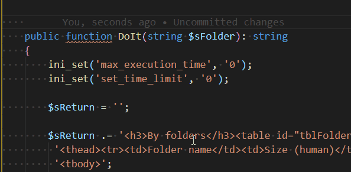

# PHP DocBlocker {#extensions-php-docblocker}

> [https://marketplace.visualstudio.com/items?itemName=neilbrayfield.php-docblocker](https://marketplace.visualstudio.com/items?itemName=neilbrayfield.php-docblocker)

Allows generating documentation blocks of classes, methods, ...

Essential extension for any PHP programmer because it allows generating docblocks to document methods, properties, constants, ... in a PHP source code.

