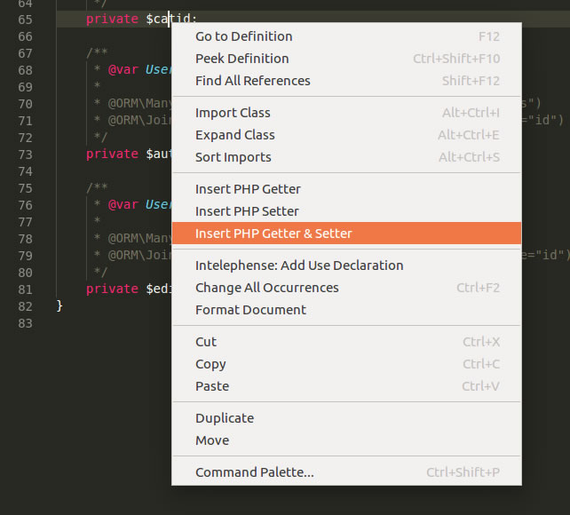

# PHP getters and setters {#extensions-php-getters-setters}

> [https://github.com/phproberto/vscode-php-getters-setters](https://github.com/phproberto/vscode-php-getters-setters)

Create a new property in your class; right-click on it and choose `Insert PHP Getter & Setter` to generate PHP code for both actions.

Really easy...

The extension can be configured (see [https://github.com/phproberto/vscode-php-getters-setters#extension-settings](https://github.com/phproberto/vscode-php-getters-setters#extension-settings)) and, if you wish, you can redefine the code of the Setter for instance (as an example, you can decide not to return the value).
