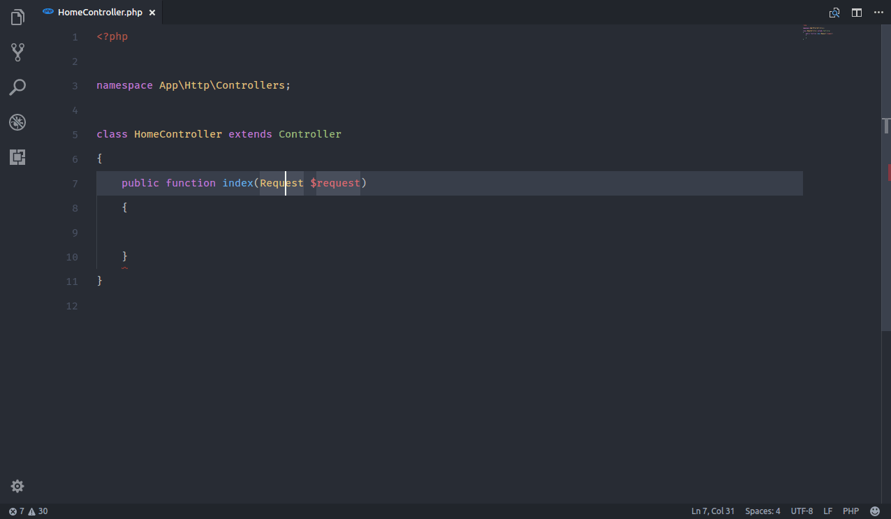

# PHP Namespace Resolver {extension-php-namespace-resolver}

> [https://marketplace.visualstudio.com/items?itemName=MehediDracula.php-namespace-resolver](https://marketplace.visualstudio.com/items?itemName=MehediDracula.php-namespace-resolver)

In a PHP file, right-click on a class name and PHP Namespace Resolver will search where that class is defined (based on your `composer.json` file). If there is only one occurrence, the class will be immediately added in a `use` command. Otherwise, you'll be prompted to select the desired one.

