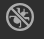
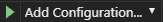
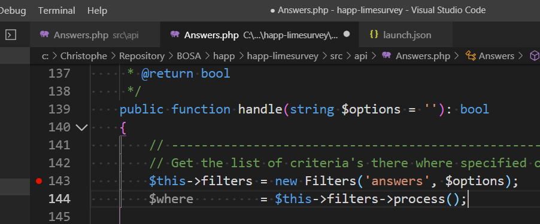
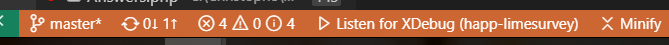
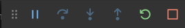
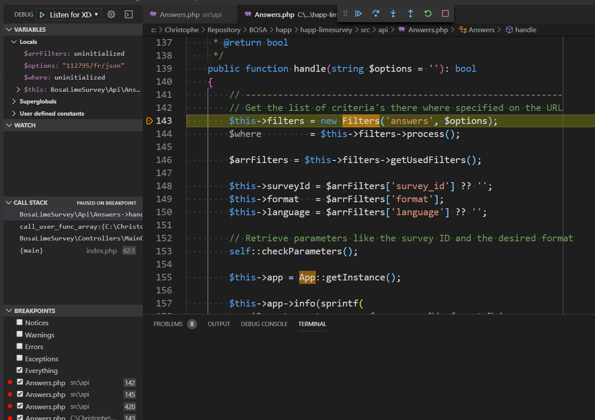

# Visual Studio Code Tip - Using xDebug

URL: [https://xdebug.org](https://xdebug.org/)

> [Tutorial](https://scotch.io/@chenster/debugging-php-in-visual-studio-code205)

## Installation

* Open `http://localhost/?phpinfo=1` and make <kbd>CTRL</kbd>-<kbd>A</kbd>/<kbd>CTRL</kbd>-<kbd>C</kbd>
* Open `https://xdebug.org/wizard.php` and <kbd>CTRL</kbd><kbd>V</kbd> there
* Click on the `Analyse my phpinfo() output` button

Follow installation steps:

* download the suggested `.dll`,
* save the file in the mentioned location,
* edit `php.ini` and add the reference to the `.dll`
* **extra step**: add the two lines below in the `php.ini` in the `[xdebug]` section

```ini
<!-- concat-md::include "./files/xdebug.ini" -->
```

* save the file
* restart the webserver

**The two variables below are important and should be initialized to 1 otherwise xdebug will not stop the code on breakpoints.**

### Check if xdebug is loaded

* Open `http://localhost/?phpinfo=1` once more
* Search for `xdebug`. A  **xdebug** table should be there with a lot of keys/values.

## Visual Studio Code

Tutorial by Microsoft: `https://code.visualstudio.com/docs/editor/debugging#_launch-configurations`

* Install the [PHP Debug](https://marketplace.visualstudio.com/itemdetails?itemName=felixfbecker.php-debug) extension
* Click on the `bug` button 
* Click on the  dropdown
* Select `Add configuration` and select `PHP` as language
* A list of options can be configured, the list is here: `https://marketplace.visualstudio.com/itemdetails?itemName=felixfbecker.php-debug#supported-launch.json-settings`

### Settings

Settings are saved in the `/.vscode/launch.json` file. A nice option is the `ignore` one who make possible to ignore certain files from a debugger perspective. Here, ask to not go into vendors scripts (and stay in our own scripts):

```json
<!-- concat-md::include "./files/launch.json" -->
```

### Use inside vscode

Open your PHP file and add breakpoints. To do so, click on the line in your code where you want that the browser needs to stop and click on the `Debug` menu then click on `Toggle breakpoint`. A red bullet will appear near the line number:



Then, once your breakpoints are in place, click on the `Debug` menu and click then on `Start Debugging`. You'll see an orange panel like the following one:



You'll also have a new toolbar:



Now, go back to your web browser and refresh your URL without any change; if your breakpoints are correctly initialized, the browser will be on *pause* and Visual Studio Code will activate the first met breakpoint.



Use <kbd>F10</kbd> to go to the next instruction or <kbd>F11</kbd> to set into the next instruction (if the instruction is a function, go inside the function).
