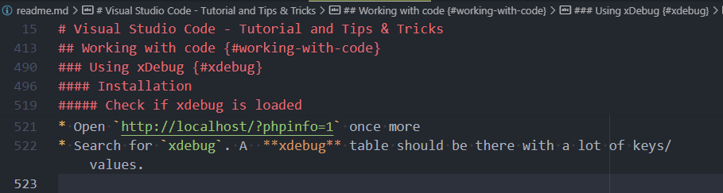

# Sticky scroll 

> [https://dev.to/amrsamy/vs-code-sticky-scroll-2jcd](https://dev.to/amrsamy/vs-code-sticky-scroll-2jcd)

There is a nice feature called `StickyScroll` you can enable by putting `"editor.stickyScroll.enabled": true` in your `settings.json` file.

The idea is, when you go deeper in a supported language (like Javascript, PHP or Markdown and much more), the name of the parent will be automatically stick on the top of the screen as illustrated in the animation above.

Another example is this documentation:

