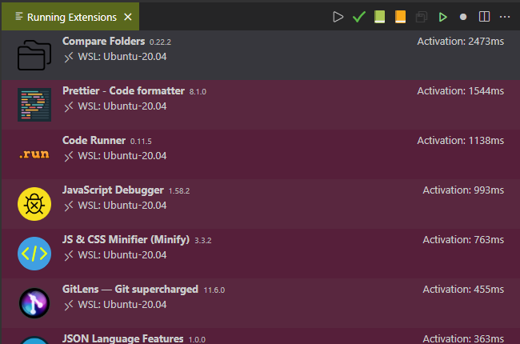

# Reduce the load time of vscode

You've installed some addons and at given time period, you're suffering on *Damned, vscode takes a lot of time to load my project*.

Press <kbd>CTRL</kbd>-<kbd>P</kbd> to open the palette and run `Developer: Show Running Extensions`.

You'll get a screen like the one below, extensions are ordered by the slowest one.

In my case, I like to use `Compare Folders` but no so often so it's best to disabled it and enable it again only on a need base. Same for `Code Runner`. By disabling these two, I earn 4 seconds each time I start vscode a day (and I start it so much for all my projects).

