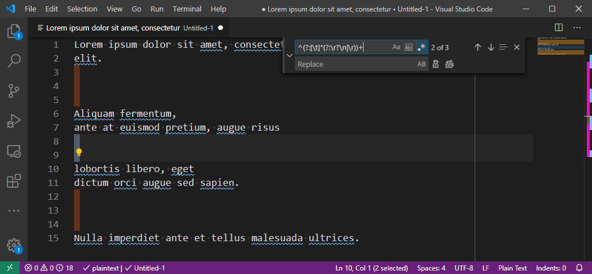
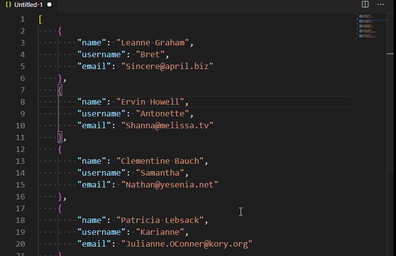
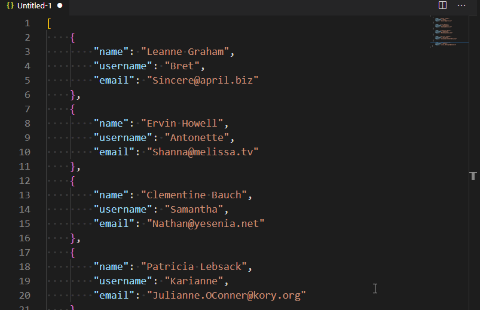

# Search and replace - Regex

## Remove all lines starting with 

Imagine you want to remove all commented lines and the character used for comments is a `#` so you want to remove lines starting with `#`.

* Search `^#.*[\n|\r]*`
* Replace by *let this field empty*

The regex means: 

* `^#`: we want all lines starting with `#`
* `.*`: followed by any character
* `[\n|\r]*`: and followed by one or more carriage return / linefeed.

## Remove all empty lines

> [https://dev.to/gyurisc/easily-remove-empty-lines-using-regular-expression-in-visual-studio-code-1230](https://dev.to/gyurisc/easily-remove-empty-lines-using-regular-expression-in-visual-studio-code-1230)

* Search `^(?:[\t]*(?:\r?\n|\r))+`
* Replace by *let this field empty*



## Remove all lines except those matching a regex

Imagine you've a big JSON file with f.i. a list of users like this:

```json
<!-- concat-md::include "./files/users.json" -->
```

From that list you wish to keep only lines with emails.

The idea is to use a regex expression so we can match email lines and use a negative search so not email lines are selected:

To match email lines (with the carriage return at the end), we'll use `.*email.*\n`.

For the use case, we'll search for `.*email.*\n` and replace by nothing: emails lines will be removed in the entire file.



Using the negative regex `^(?!.*email).*$\n` will match all lines except the ones containing the email word and, here too, if we search and replace by nothing, we'll remove all lines except emails:


