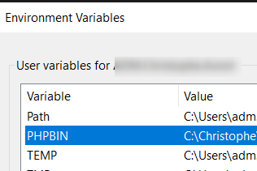

# Intelephense {#troubleshooting-intelephense}

In order to avoid errors with `Intelephense` like `Undefined function xxx` (f.i. `trim`) or `Undefined type xxx` (f.i. `stdClass`) for core PHP features, make sure to specify in your `settings.json`  file the correct PHP version you're using.

```json
"intelephense.environment.phpVersion": "7.4.4"
```

That version should match the one you've defined in the `PHPBIN` environment variable:


