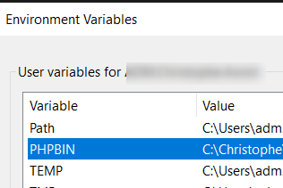

# Phan {#troubleshooting-phan}

Make sure to specify in your `settings.json` file the PHP version you're using:

```json
"phan.phpExecutablePath": ""C:\\wamp64\\bin\\php\\php7.4.4\\php.exe"
```

That version should match the one you've defined in the `PHPBIN` environment variable:


