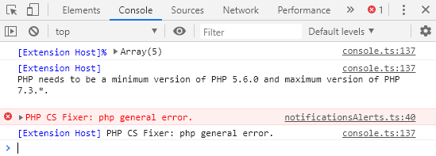

# PHP-CS-FIXER {#troubleshooting-php-cs-fixer}

## PHP General Error {#troubleshooting-php-cs-fixer-php-general-error}

By calling a PHP-CS-FIXER function like running `Fix this file` (<kbd>ALT</kbd>-<kbd>SHIFT</kbd>-<kbd>F</kbd>), you can get the following error:

To get more information, make sure to display the `Developer Tools` (<kbd>CTRL</kbd>-<kbd>SHIFT</kbd>-<kbd>I</kbd>) in the `Help` menu. You'll get there extra information's.

As we can see here above, our PHP-CS-FIXER needs to be updated: we're using a more recent version of PHP and the maximum supported by the current PHP-CS-FIXER installed version is an old one.
