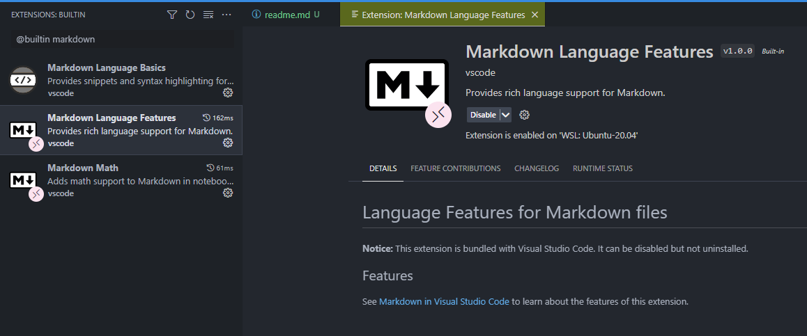

# Markdown folding not working

> [https://github.com/microsoft/vscode/issues/107130](https://github.com/microsoft/vscode/issues/107130)

In case code folding is not working in markdown mode, make sure the `@builtin` **Markdown Language Features** addon is enabled.

