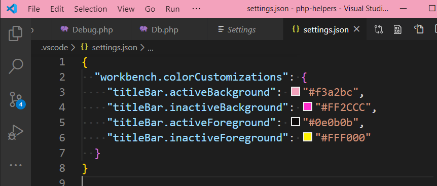

# VSCode Tricks

> Collection of tips and tricks for Visual Studio Code

* [Interface tips](#interface-tips)
  * [Use color to identify projects](#use-color-to-identify-projects)
* [License](#license)

## Interface tips

### Use color to identify projects

Colors have to be set in the `.vscode/settings.json` file in the project root folder; example:

```json
{
  "workbench.colorCustomizations": {
    "titleBar.activeBackground": "#f3a2bc",
    "titleBar.inactiveBackground": "#FF2CCC",
    "titleBar.activeForeground": "#0e0b0b",
    "titleBar.inactiveForeground": "#FFF000"
  }
}
```

To open that settings file, just go to your `Workspace settings` page.



Happy coloring 😉

## License

[MIT](LICENSE)
