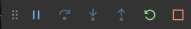
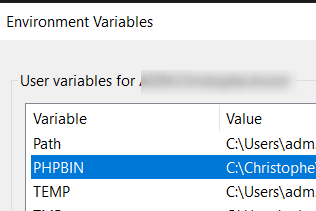

<!-- This file has been generated automatically by the following script -->
<!-- C:\Christophe\Repository\writing-documentation\concat-md\concat-md.ps1 -->
<!-- So don't modify this file manually but run the tool once more instead -->

<!-- Last refresh date: 2020-04-25 22:24:44 -->

<!-- below, content of ./index.md -->

# Visual Studio Code - Tutorial


> Tutorial and collection of tips and tricks for Visual Studio Code

<!-- table-of-contents - start -->
* [Discovering Visual Studio Code {#discovering}](#discovering-visual-studio-code-discovering)
    * [Installation {#discovering-installation}](#installation-discovering-installation)
    * [The first keyboard shortcuts to learn {#discovering-shortcuts}](#the-first-keyboard-shortcuts-to-learn-discovering-shortcuts)
    * [Settings {#discovering-settings}](#settings-discovering-settings)
    * [Working with files and folders {#working-with-files}](#working-with-files-and-folders-working-with-files)
       * [Keyboard shortcuts {#working-with-files-shortcuts}](#keyboard-shortcuts-working-with-files-shortcuts)
    * [Code traversal - Navigation {#traversal}](#code-traversal-navigation-traversal)
       * [Keyboard shortcuts {#traversal-shortcuts}](#keyboard-shortcuts-traversal-shortcuts)
       * [Select first {#traversal-select-first}](#select-first-traversal-select-first)
    * [Snippets {#snippets}](#snippets-snippets)
       * [Built-in {#snippets-built-in}](#built-in-snippets-built-in)
       * [User defined ones {#snippets-user-defined}](#user-defined-ones-snippets-user-defined)
       * [Make snippets configurable {#snippets-user-placeholders}](#make-snippets-configurable-snippets-user-placeholders)
       * [Using variables](#using-variables)
       * [Settings {#snippets-settings}](#settings-snippets-settings)
       * [Extensions {#snippets-extensions}](#extensions-snippets-extensions)
    * [Using the built-in terminal {#terminal}](#using-the-built-in-terminal-terminal)
* [Working with code {#working-with-code}](#working-with-code-working-with-code)
    * [Code folding {#{#working-with-code-folding}](#code-folding-working-with-code-folding)
    * [Comments {#working-with-code-comments}](#comments-working-with-code-comments)
* [Some settings {#settings}](#some-settings-settings)
    * [Editor settings {#settings-editor}](#editor-settings-settings-editor)
    * [Files settings {#settings-files}](#files-settings-settings-files)
    * [Search settings {#settings-search}](#search-settings-settings-search)
    * [Telemetry settings {#settings-telemetry}](#telemetry-settings-settings-telemetry)
    * [Window settings {#settings-window}](#window-settings-settings-window)
    * [Workbench settings {#settings-workbench}](#workbench-settings-settings-workbench)
* [Extensions {#extensions}](#extensions-extensions)
    * [Extend core features of Visual Studio Code {#extensions-core}](#extend-core-features-of-visual-studio-code-extensions-core)
       * [Active File In StatusBar {#extensions-active-file-statusbar}](#active-file-in-statusbar-extensions-active-file-statusbar)
       * [Autofold {#extensions-autofold}](#autofold-extensions-autofold)
       * [Better comments {#extensions-better-comments}](#better-comments-extensions-better-comments)
       * [Bookmarks {#extensions-bookmarks}](#bookmarks-extensions-bookmarks)
       * [Bracket Pair Colorizer {#extensions-bracket-pair-colorizer}](#bracket-pair-colorizer-extensions-bracket-pair-colorizer)
       * [Code Spell Checker {#extensions-code-spell-checker}](#code-spell-checker-extensions-code-spell-checker)
       * [Favorites {#extensions-favorites}](#favorites-extensions-favorites)
       * [Colouring of source codes according to the language {#extensions-highlight}](#colouring-of-source-codes-according-to-the-language-extensions-highlight)
          * [Apache configuration file {#highlight-apache}](#apache-configuration-file-highlight-apache)
          * [Log File Highlighter {#extensions_log-file-highlighter}](#log-file-highlighter-extensions_log-file-highlighter)
       * [Prettier {#extensions-prettier-vscode}](#prettier-extensions-prettier-vscode)
       * [Project Manager {#extensions-project-manager}](#project-manager-extensions-project-manager)
       * [Select highlight in minimap {#extensions-select-highlight-minimap}](#select-highlight-in-minimap-extensions-select-highlight-minimap)
       * [Snippet-creator {#extensions-snippet-creator}](#snippet-creator-extensions-snippet-creator)
       * [Sort lines {#extensions-sort-lines}](#sort-lines-extensions-sort-lines)
       * [Surround {#extensions-surround}](#surround-extensions-surround)
       * [Syncing {#extensions-syncing}](#syncing-extensions-syncing)
       * [Todo Tree {#extensions-todo-tree}](#todo-tree-extensions-todo-tree)
       * [vscode-icons {#extensions-vscode-icons}](#vscode-icons-extensions-vscode-icons)
    * [Javascript {#extensions-javascript}](#javascript-extensions-javascript)
       * [ESLint {#extensions-eslint}](#eslint-extensions-eslint)
    * [Markdown {#extensions-markdown}](#markdown-extensions-markdown)
       * [Markdown All in One {#extensions-markdown-all-in-one}](#markdown-all-in-one-extensions-markdown-all-in-one)
       * [Markdownlint {#extensions-markdownlint}](#markdownlint-extensions-markdownlint)
          * [Configuration {#extensions-markdownlint-configuration}](#configuration-extensions-markdownlint-configuration)
    * [PHP {#extensions-php}](#php-extensions-php)
       * [PHP intelephense {#extensions-php-intelephense}](#php-intelephense-extensions-php-intelephense)
          * [Configuration {#extensions-php-intelephense-configuration}](#configuration-extensions-php-intelephense-configuration)
       * [Laravel Blade Snippets {#extensions-laravel-blade}](#laravel-blade-snippets-extensions-laravel-blade)
       * [PHP-CS-FIXER {#extensions-php-cs-fixer}](#php-cs-fixer-extensions-php-cs-fixer)
       * [PHP DocBlocker {#extensions-php-docblocker}](#php-docblocker-extensions-php-docblocker)
       * [PHP Extension Pack {#extensions-php-extension-pack}](#php-extension-pack-extensions-php-extension-pack)
       * [PHP IntelliSense {#extensions-php-intellisense}](#php-intellisense-extensions-php-intellisense)
* [Visual Studio Code Tip - Using xDebug](#visual-studio-code-tip-using-xdebug)
    * [Installation](#installation)
       * [Check if xdebug is loaded](#check-if-xdebug-is-loaded)
    * [Visual Studio Code](#visual-studio-code)
       * [Settings](#settings)
       * [Use inside vscode](#use-inside-vscode)
* [Tips](#tips)
    * [editorconfig](#editorconfig)
    * [Interface](#interface)
       * [Use color to identify projects](#use-color-to-identify-projects)
    * [Keyboard shortcuts for Windows](#keyboard-shortcuts-for-windows)
* [Troubleshooting {#troubleshooting}](#troubleshooting-troubleshooting)
    * [Intelephense {#troubleshooting-intelephense}](#intelephense-troubleshooting-intelephense)
    * [Phan {#troubleshooting-phan}](#phan-troubleshooting-phan)
* [License](#license)
<!-- table-of-contents - end -->

<!-- below, content of ./010-first-approach/readme.md -->

## Discovering Visual Studio Code {#discovering}

<!-- below, content of ./010-first-approach/010-installation/readme.md -->

### Installation {#discovering-installation}

Download [Visual Studio Code](https://code.visualstudio.com/).

The [Insiders version](https://code.visualstudio.com/insiders/) contains the very latest version but can be unstable.

<!-- below, content of ./010-first-approach/020-interface-shortcuts/readme.md -->

### The first keyboard shortcuts to learn {#discovering-shortcuts}

* <kbd>CTRL</kbd>-<kbd>O</kbd> to open a file
* <kbd>CTRL</kbd>-<kbd>K</kbd>-<kbd>CTRL</kbd>-<kbd>O</kbd> to open a folder (a project).
* <kbd>CTRL</kbd>-<kbd>P</kbd> to quickly retrieve and open a file in an open project.
* <kbd>CTRL</kbd>-<kbd>O</kbd> to open a recent folder (a project).
* <kbd>SHIFT</kbd>-<kbd>CTRL</kbd>-<kbd>F</kbd> to open the `search` pane (when a project has been opened).
* <kbd>SHIFT</kbd>-<kbd>CTRL</kbd>-<kbd>P</kbd> to open the `command palette` to quick access all commands of the editor.
* <kbd>CTRL</kbd>-<kbd>,</kbd> to get access to the `User Settings`.
* <kbd>SHIFT</kbd>-<kbd>CTRL</kbd>-<kbd>X</kbd> to open the list of `Extensions`.
* <kbd>CTRL</kbd>-<kbd>B</kbd> show/hide the left side-bar (if <kbd>CTRL</kbd>-<kbd>B</kbd> isn't used like in markdown files to set in bold).
* <kbd>CTRL</kbd>-<kbd>K</kbd>-<kbd>Z</kbd> maximize the screen, aka `Zen mode`.

<!-- below, content of ./010-first-approach/030-settings/readme.md -->

### Settings {#discovering-settings}

There are two sorts of settings: `User` or `Workspace`. Remember, you can quickly access settings thanks the <kbd>CTRL</kbd>-<kbd>,</kbd shortcut.

 `User` settings are for all yours projects and stored in the `%APPDATA%\Code\User\settings.json` file.

 `Workspace` settings are the opened project and stored in the `.vscode/settings.json` file (in the project's structure).

<!-- below, content of ./010-first-approach/040-working-with-files-folders/readme.md -->

### Working with files and folders {#working-with-files}

The most efficient way to do is to use the tree-view at the left and right-click where the file/folder should be created.

Select the parent folder, right-click and select `New file` or `New folder`.

#### Keyboard shortcuts {#working-with-files-shortcuts}

* <kbd>SHIFT</kbd>-<kbd>CTRL</kbd>-<kbd>E</kbd> when a file is opened will activate the tree-view, retrieve the file and highlight it.

<!-- below, content of ./010-first-approach/050-traversal/index.md -->

### Code traversal - Navigation {#traversal}

#### Keyboard shortcuts {#traversal-shortcuts}

* <kbd>CTRL</kbd>-<kbd>P</kbd> to quick open / go to an opened file. Files are sorted in the list from the most recent till the last recent so it's easy to go back to the previously edited file.
* <kbd>CTRL</kbd>-<kbd>P</kbd>-<kbd>CTRL</kbd>-<kbd>P</kbd> to open the most recent file (the second file in the list). You can press CTRL-P again and again to go the the third, fourth, ... When you'll release keys, the selected file will be immediately open.
* <kbd>CTRL</kbd>-<kbd>SHIFT</kbd>-<kbd>O</kbd> to open (browse) a symbol[^symbol] in the opened file. Navigating with the arrows will select the portion of code in the editor.
* <kbd>CTRL</kbd>-<kbd>T</kbd> to open (browse) a symbol[^symbol] in the entire project. In a markdown file, <kbd>CTRL</kbd>-<kbd>T</kbd> will display the list of every headings f.i.
* <kbd>CTRL</kbd>-<kbd>TAB</kbd> to switch between opened tabs (just like Windows and active applications).

#### Select first {#traversal-select-first}

* Select a word, a function name, a variable, a constant then press <kbd>CTRL</kbd>-<kbd>T</kbd> to open a list where that selection can be found. For instance, by selecting a constant name and pressing <kbd>CTRL</kbd>-<kbd>T</kbd> you'll obtain the full list of files using that constant and the one who defines the constant.

<!-- below, content of ./010-first-approach/060-snippets/readme.md -->

### Snippets {#snippets}

#### Built-in {#snippets-built-in}

Snippets are pieces of pre-programmed code (like a `try...catch...`) that allow you to generate code without typing it entirely.

Depending on the open file and its language (php, js, markdown, ...), *VSCode* will offer standard snippets and it will also be possible to program your own.

Press <kbd>CTRL</kbd>-<kbd>SHIFT</kbd>-<kbd>P</kbd> to open the Palette Command then type `Insert Snippet` to get the list of already existing snippets.

#### User defined ones {#snippets-user-defined}

It is however possible to write your own snippets: press <kbd>CTRL</kbd>-<kbd>SHIFT</kbd>-<kbd>P</kbd> then `Configure User Snippets`. The programming language is chosen, e.g. `PHP`, which will open an editor with, here, the open `PHP` file.

A file called `php.json` will be opened and you can start to create a snippet; f.i.:

```json
{
    "strict": {
        "prefix": "strict",
        "body": [
            "declare (strict_types = 1);",
            ""
        ],
        "description": "Add strict_types"
    }
}
```

The code here above define a snippet called `strict` and it's for a `.php` file. Open such file, start to type `stri` (you can type only a few letters) and press the <kbd>CTRL</kbd>-<kbd>space</kbd> keys. Select the snippet and press <kbd>enter</kbd>. You'll get the code defined in the `body`. It's magic.

Note: you can also desired to just press the <kbd>TAB</kbd> key. If so, check your `User Settings` and make sure the following key is well on `on`:

```json
{
    "editor.tabCompletion": "on"
}
```

#### Make snippets configurable {#snippets-user-placeholders}

Take a look on the following snippet and the `$1` and `$2` placeholders.

```json
{
    "var-dump": {
        "prefix": "vd",
        "body": [
            "echo '<pre>'.__METHOD__.'--'.__LINE__.'</pre>';",
            "echo '<pre>'.print_r($1, true).'</pre>';",
            "die($2);"
        ],
        "description": "Debug - Die and echo file/line info"
    }
}
```

Save this snippet in your editor and, in a `php` file, type `vd` followed by <kbd>CTRL</kbd>-<kbd>space</kbd>. You'll get now three new lines and the cursor will be placed where the `$1` placeholder was. Type a PHP variable and press <kbd>TAB</kbd> and see, the cursor will be now immediately put where `$2` was located. Thanks these placeholders it's easy to foresee, in a snippet, locations where you need to type dynamic content like variables, custom text, ...

#### Using variables

When creating a snippet, we can f.i. use the current PHP filename. Imagine you've a file name `Customer.php` and there you wish to create a new class.

The following snippet will do the magic:

```json
{
    "Class": {
        "prefix": "class",
        "body": [
            "class ${TM_FILENAME_BASE}",
            "{",
            "    return;",
            "}"
        ],
        "description": "Create a new class"
    }
}
```

The `TM_FILENAME_BASE` variable will be replaced by VS Code to the filename *(without the extension)* so we'll get a new class called `Customer`.

See all variables here: [https://code.visualstudio.com/docs/editor/userdefinedsnippets#_variables](https://code.visualstudio.com/docs/editor/userdefinedsnippets#_variables)

#### Settings {#snippets-settings}

User snippets are stored in the `%APPDATA%\code\user\snippets` folder, one `.json` file by languages.

#### Extensions {#snippets-extensions}

Also see the [snippet-creator](#extensions-snippet-creator) extension.

<!-- below, content of ./010-first-approach/070-terminal/readme.md -->

### Using the built-in terminal {#terminal}

Press <kbd>CTRL</kbd>-<kbd>SHIFT</kbd>-<kbd>ù</kbd> to open the built-in terminal.

Press <kbd>CTRL</kbd>-<kbd>SHIFT</kbd>-<kbd>C</kbd> to open a DOS Prompt session where the current folder will be the opened project.

You can choose for a DOS terminal, Powershell or bash one. Just select the `Select Default Shell` option and VS Code will prompt which shell application should be used.


Note: by clicking on the `+` button, we can create as many terminal we want.

<!-- below, content of ./020-working-with-code/readme.md -->

## Working with code {#working-with-code}

### Code folding {#{#working-with-code-folding}

* <kbd>CTRL</kbd>-<kbd>K</kbd>-<kbd>CTRL</kbd>-<kbd>à</kbd> to collapse all functions, headings, ... The same can be obtained by <kbd>CTRL</kbd>-<kbd>SHIFT</kbd>-<kbd>P</kbd> then `Fold all`.
* <kbd>CTRL</kbd>-<kbd>K</kbd>-<kbd>CTRL</kbd>-<kbd>J</kbd> to expand all functions, headings, ... The same can be obtained by <kbd>CTRL</kbd>-<kbd>SHIFT</kbd>-<kbd>P</kbd> then `Unfold all`.
* <kbd>CTRL</kbd>-<kbd>K</kbd>-<kbd>CTRL</kbd>-<kbd>&</kbd> - Collapse level 1.
* <kbd>CTRL</kbd>-<kbd>K</kbd>-<kbd>CTRL</kbd>-<kbd>é</kbd> - Collapse level 2.
* <kbd>CTRL</kbd>-<kbd>K</kbd>-<kbd>CTRL</kbd>-<kbd>"</kbd> - Collapse level 3.
* <kbd>CTRL</kbd>-<kbd>K</kbd>-<kbd>CTRL</kbd>-<kbd>'</kbd> - Collapse level 4.
* <kbd>CTRL</kbd>-<kbd>K</kbd>-<kbd>CTRL</kbd>-<kbd>(</kbd> - Collapse level 5.
* <kbd>CTRL</kbd>-<kbd>K</kbd>-<kbd>CTRL</kbd>-<kbd>§</kbd> - Collapse level 6.
* <kbd>CTRL</kbd>-<kbd>K</kbd>-<kbd>CTRL</kbd>-<kbd>è</kbd> - Collapse level 7.
* <kbd>CTRL</kbd>-<kbd>K</kbd>-<kbd>CTRL</kbd>-<kbd>)</kbd> - Collapse the bloc where the cursor is located.

### Comments {#working-with-code-comments}

Select a bloc of lines then,

* <kbd>CTRL</kbd>-<kbd>K</kbd>-<kbd>CTRL</kbd>-<kbd>C</kbd> to put that bloc in comments (add `//` in front of each line).
* <kbd>CTRL</kbd>-<kbd>K</kbd>-<kbd>CTRL</kbd>-<kbd>U</kbd> to remove the comments (remove `//` in front of each line).

<!-- below, content of ./050-settings/readme.md -->

## Some settings {#settings}

<!-- below, content of ./050-settings/editor/readme.md -->

### Editor settings {#settings-editor}

Adapts the size of the font used:

```json
{
    "editor.fontSize": 18
}
```

Format the code during a copy/paste:

```json
{
    "editor.formatOnPaste": true
}
```

Format the code when saving:

```json
{
    "editor.formatOnSave": true
}
```

Indentation: tabs or spaces? `true` for spaces, `false` for tabs:

```json
{
    "editor.insertSpaces": false
}
```

Stop displaying the list of open files (top left):

```json
{
    "explorer.openEditors.visible": 0
}
```

Display a grayed out "dot" to make spaces visible:

```json
{
    "editor.renderWhitespace": "all",
}
```

When using snippets, pressing the Tab key will activate the conversion from the shortcut to the content of the snippet:

```json
{
    "editor.tabCompletion": true
}
```

Spécifie la taille d'une tabulation :

```json
{
    "editor.tabSize": 3
}
```

<!-- below, content of ./050-settings/files/readme.md -->

### Files settings {#settings-files}

Associating certain extensions with programming languages:

```json
{
    "files.associations": {
        ".frm": "html",
        ".php-cs": "php"
    }
}
```

Specifies the default language for new :

```json
{
    "files.defaultLanguage": "PHP"
}
```

Specifies the default format for CRLF (Windows) or LF (Unix) files:

```json
{
    "files.eol": "\n"
}
```

If you don't want to see certain files / folders in your :

```json
{
    "files.exclude": {
        "**/.DS_Store": true,
        "**/.git": true,
        "**/.hg": true,
        "**/.svn": true,
        "**/CVS": true,
        "**/libs/**": true
    }
}
```

<!-- below, content of ./050-settings/search/redme.md -->

### Search settings {#settings-search}

If you want the search feature to ignore certain files / folders :

```json
{
    "search.exclude": {
        "**/bower_components": true,
        "**/node_modules": true,
        "**/libs/**": true
    }
}
```

<!-- below, content of ./050-settings/telemetry/readme.md -->

### Telemetry settings {#settings-telemetry}

Disables telemetry to Microsoft:

```json
{
    "telemetry.enableCrashReporter": false,
    "telemetry.enableTelemetry": false
}
```

<!-- below, content of ./050-settings/window/readme.md -->

### Window settings {#settings-window}

When you open a file and then open another one without modifying the first one, the editor will open the second file in the same tab; the first file will then be closed.

If you want to open each time in a new tab, you have to adapt the parameter below:

```json
{
    "window.openFilesInNewWindow": "on"
}
```

Changes the zoom level:

```json
{
    "window.zoomLevel": 5
}
```

<!-- below, content of ./050-settings/workbench/readme.md -->

### Workbench settings {#settings-workbench}

Don't display the vertical menu bar on the left side which includes icons for files, search, Git, ...:

```json
{
    "workbench.activityBar.visible": false
}
```

Stop displaying the status bar that appears at the bottom of the screen :

```json
{
    "workbench.statusBar.visible": false
}
```

<!-- below, content of ./060-extensions/readme.md -->

## Extensions {#extensions}

Some extensions that will be useful for any PHP developer.

Note: to get the list of already installed extensions, press <kbd>CTRL</kbd>-<kbd>SHIFT</kbd>-<kbd>X</kbd> and type `@installed` in the text box to get the list.

<!-- below, content of ./060-extensions/core/readme.md -->

### Extend core features of Visual Studio Code {#extensions-core}

<!-- below, content of ./060-extensions/core/active_file/readme.md -->

#### Active File In StatusBar {#extensions-active-file-statusbar}

> [https://marketplace.visualstudio.com/items?itemName=RoscoP.ActiveFileInStatusBar](https://marketplace.visualstudio.com/items?itemName=RoscoP.ActiveFileInStatusBar)

Displays the full name of the file being edited at the bottom of the screen and allows, for example, to copy/paste its name by clicking on it.


<!-- below, content of ./060-extensions/core/autofold/readme.md -->

#### Autofold {#extensions-autofold}

> [https://marketplace.visualstudio.com/items?itemName=bobmagicii.autofoldyeah](https://marketplace.visualstudio.com/items?itemName=bobmagicii.autofoldyeah)

By opening a file, the autofold extension can automatically collapse docblocks, functions, ...

The level (collapse all, from the second, third, ... level) can be configured for each file extension separately.

Here is a sample: by opening that source file, comment's and function's code is collapse automatically, we've directly a better view on what that file is doing.


<!-- below, content of ./060-extensions/core/better-comments/readme.md -->

#### Better comments {#extensions-better-comments}

> [https://marketplace.visualstudio.com/items?itemName=aaron-bond.better-comments](https://marketplace.visualstudio.com/items?itemName=aaron-bond.better-comments)

The Better Comments extension will help you create more human-friendly comments in your code.


<!-- below, content of ./060-extensions/core/bookmarks/readme.md -->

#### Bookmarks {#extensions-bookmarks}

> [https://marketplace.visualstudio.com/items?itemName=alefragnani.Bookmarks](https://marketplace.visualstudio.com/items?itemName=alefragnani.Bookmarks)

Allows you to put files in a Bookmark folder, displayed in the icon bar on the left. This allows you to jump very quickly to a file, to a specific line (which would have been bookmarked).

<!-- below, content of ./060-extensions/core/bracket-pair-colorizer/readme.md -->

#### Bracket Pair Colorizer {#extensions-bracket-pair-colorizer}

> [https://marketplace.visualstudio.com/items?itemName=CoenraadS.bracket-pair-colorizer](https://marketplace.visualstudio.com/items?itemName=CoenraadS.bracket-pair-colorizer)

Uses different colors in the editor to properly identify brackets and opening / closing braces.


<!-- below, content of ./060-extensions/core/code-spell-checker/readme.md -->

#### Code Spell Checker {#extensions-code-spell-checker}

> [https://marketplace.visualstudio.com/items?itemName=streetsidesoftware.code-spell-checker](https://marketplace.visualstudio.com/items?itemName=streetsidesoftware.code-spell-checker)

A basic spell checker that works well with camelCase code.

The goal of this spell checker is to help catch common spelling errors while keeping the number of false positives low.


<!-- below, content of ./060-extensions/core/favorites/readme.md -->

#### Favorites {#extensions-favorites}

> [https://marketplace.visualstudio.com/items?itemName=kdcro101.favorites](https://marketplace.visualstudio.com/items?itemName=kdcro101.favorites)

Allows you to group shortcuts to files that, for example, you often have to open.


<!-- below, content of ./060-extensions/core/highlight/readme.md -->

#### Colouring of source codes according to the language {#extensions-highlight}

<!-- below, content of ./060-extensions/core/highlight/apache/readme.md -->

##### Apache configuration file {#highlight-apache}

> [https://marketplace.visualstudio.com/items?itemName=mrmlnc.vscode-apache](https://marketplace.visualstudio.com/items?itemName=mrmlnc.vscode-apache)

Support (coloring) Apache files such as `.htaccess`, `.htpasswd`, `.conf` and `.htgroups`.


<!-- below, content of ./060-extensions/core/highlight/log-file-highlighter/readme.md -->

##### Log File Highlighter {#extensions_log-file-highlighter}

> [https://marketplace.visualstudio.com/items?itemName=emilast.LogFileHighlighter](https://marketplace.visualstudio.com/items?itemName=emilast.LogFileHighlighter)

Log file highlight.


<!-- below, content of ./060-extensions/core/prettier-vscode/readme.md -->

#### Prettier {#extensions-prettier-vscode}

> [https://marketplace.visualstudio.com/items?itemName=esbenp.prettier-vscode](https://marketplace.visualstudio.com/items?itemName=esbenp.prettier-vscode)

Prettier is an opinionated code formatter. It enforces a consistent style by parsing your code and re-printing it with its own rules that take the maximum line length into account, wrapping code when necessary.

<!-- below, content of ./060-extensions/core/project-manager/readme.md -->

#### Project Manager {#extensions-project-manager}

> [https://marketplace.visualstudio.com/items?itemName=alefragnani.project-manager](https://marketplace.visualstudio.com/items?itemName=alefragnani.project-manager)

Easily switch between projects.


<!-- below, content of ./060-extensions/core/select-highlight-minimap/readme.md -->

#### Select highlight in minimap {#extensions-select-highlight-minimap}

> [https://marketplace.visualstudio.com/items?itemName=mde.select-highlight-minimap](https://marketplace.visualstudio.com/items?itemName=mde.select-highlight-minimap)

Highlights the selected code (e.g. a function name) in the minimap so that you can quickly identify where in the currently edited file the same function is called.


<!-- below, content of ./060-extensions/core/snippet-creator/readme.md -->

#### Snippet-creator {#extensions-snippet-creator}

The [snippet-creator](https://marketplace.visualstudio.com/items?itemName=nikitaKunevich.snippet-creator) extension simplifies the creation of a snippet from existing code. Simply select the code already present in a file and then do a <kbd>CTRL</kbd>-<kbd>SHIFT</kbd>-<kbd>P</kbd>, type `Create Snippet` to call the wizard.

*Note: the extension is actually deprecated (may 2020).*

<!-- below, content of ./060-extensions/core/sort-lines/readme.md -->

#### Sort lines {#extensions-sort-lines}

> [https://marketplace.visualstudio.com/items?itemName=Tyriar.sort-lines](https://marketplace.visualstudio.com/items?itemName=Tyriar.sort-lines)

Sorts lines of text.


<!-- below, content of ./060-extensions/core/surround/readme.md -->

#### Surround {#extensions-surround}

> [https://marketplace.visualstudio.com/items?itemName=yatki.vscode-surround](https://marketplace.visualstudio.com/items?itemName=yatki.vscode-surround)

On sélectionne un bloc de lignes de code puis, grâce à Surround, on peut l'inclure dans un `if/else`, `try/catch`, ... L'outil fait lui-même l'indentation du code.


<!-- below, content of ./060-extensions/core/Syncing/readme.md -->

#### Syncing {#extensions-syncing}

> [https://marketplace.visualstudio.com/items?itemName=nonoroazoro.syncing](https://marketplace.visualstudio.com/items?itemName=nonoroazoro.syncing)

Synchronize all of your VSCode settings across multiple devices.

<!-- below, content of ./060-extensions/core/todo-tree/readme.md -->

#### Todo Tree {#extensions-todo-tree}

> [https://marketplace.visualstudio.com/items?itemName=Gruntfuggly.todo-tree](https://marketplace.visualstudio.com/items?itemName=Gruntfuggly.todo-tree)

Displays an icon on the left side of the screen, in the form of a tree, which allows you to find, in one place, the list of TODOs that you have to make, i.e. comments beginning with `// TODO` that have been encoded in the source files.


<!-- below, content of ./060-extensions/core/vscode-icons/readme.md -->

#### vscode-icons {#extensions-vscode-icons}

> [https://marketplace.visualstudio.com/items?itemName=robertohuertasm.vscode-icons](https://marketplace.visualstudio.com/items?itemName=robertohuertasm.vscode-icons)

Adapt the tree-view with the list of files to use an icon associated to the type of file (css, html, php, ...)


<!-- below, content of ./060-extensions/javascript/readme.md -->

### Javascript {#extensions-javascript}

<!-- below, content of ./060-extensions/javascript/eslint/readme.md -->

#### ESLint {#extensions-eslint}

> [https://marketplace.visualstudio.com/items?itemName=dbaeumer.vscode-eslint](https://marketplace.visualstudio.com/items?itemName=dbaeumer.vscode-eslint)

Javascript linter

<!-- below, content of ./060-extensions/markdown/readme.md -->

### Markdown {#extensions-markdown}

<!-- below, content of ./060-extensions/markdown/markdown-all-in-one/readme.md -->

#### Markdown All in One {#extensions-markdown-all-in-one}

> [https://marketplace.visualstudio.com/items?itemName=yzhang.markdown-all-in-one](https://marketplace.visualstudio.com/items?itemName=yzhang.markdown-all-in-one)

Implements keyboard shortcuts for the Markdown language, allows the generation of tables of contents, preview, ...

<!-- below, content of ./060-extensions/markdown/markdown-lint/readme.md -->

#### Markdownlint {#extensions-markdownlint}

* [https://github.com/DavidAnson/vscode-markdownlint](https://github.com/DavidAnson/vscode-markdownlint)

##### Configuration {#extensions-markdownlint-configuration}

You can configure markdownlint to ignore some files or some rules.

The list of rules can be retrieved from [https://github.com/DavidAnson/markdownlint/blob/master/doc/Rules.md](https://github.com/DavidAnson/markdownlint/blob/master/doc/Rules.md).

To ignore f.i. the rule MD041, just add the following configuration in your `settings.json` file:

{
    "markdownlint.config": {
        "MD041": false
    }
}

To ignore files use the `ignore` key:

{
    "markdownlint.config": {
        "ignore": [
            "!**/History.md"
        ]
    }
}

Set your custom rules:

{
    "markdownlint.customRules": [
        "C:\\Christophe\\.config\\.markdownlint.json"
    ]
}

<!-- below, content of ./060-extensions/php/readme.md -->

### PHP {#extensions-php}

<!-- below, content of ./060-extensions/php/intelephense/readme.md -->

#### PHP intelephense {#extensions-php-intelephense}

> [https://github.com/bmewburn/vscode-intelephense](https://github.com/bmewburn/vscode-intelephense)

##### Configuration {#extensions-php-intelephense-configuration}

After installation, we need to disable the built-in PHP feature of VSCode.

1. Go to the extensions tab (<kbd>CTRL</kbd>-<kbd>SHIFT</kbd>-<kbd>X</kbd>)
2. Search for `@builtin php`
3. Select `PHP Language Features`
4. Disable it.

<!-- below, content of ./060-extensions/php/laravel-blade/readme.md -->

#### Laravel Blade Snippets {#extensions-laravel-blade}

> [https://marketplace.visualstudio.com/items?itemName=onecentlin.laravel-blade](https://marketplace.visualstudio.com/items?itemName=onecentlin.laravel-blade)

Helper for working with Laravel Blade templates.

<!-- below, content of ./060-extensions/php/php-cs-fixer/readme.md -->

#### PHP-CS-FIXER {#extensions-php-cs-fixer}

> [https://marketplace.visualstudio.com/items?itemName=junstyle.php-cs-fixer](https://marketplace.visualstudio.com/items?itemName=junstyle.php-cs-fixer)

Automatic correction of the quality of PHP code formatting thanks to quality standards (e.g. PSR2), which can be overloaded through a configuration file.

<!-- below, content of ./060-extensions/php/php-docblocker/readme.md -->

#### PHP DocBlocker {#extensions-php-docblocker}

> [https://marketplace.visualstudio.com/items?itemName=neilbrayfield.php-docblocker](https://marketplace.visualstudio.com/items?itemName=neilbrayfield.php-docblocker)

Allows to generate documentation blocks of classes, methods, ...

<!-- below, content of ./060-extensions/php/php-extension-pack/reame.md -->

#### PHP Extension Pack {#extensions-php-extension-pack}

> [https://marketplace.visualstudio.com/items?itemName=felixfbecker.php-pack](https://marketplace.visualstudio.com/items?itemName=felixfbecker.php-pack)

Includes the most important extensions to get you started with PHP development in Visual Studio Code.

<!-- below, content of ./060-extensions/php/php-intellisense/readme.md -->

#### PHP IntelliSense {#extensions-php-intellisense}

> [https://marketplace.visualstudio.com/items?itemName=felixfbecker.php-intellisense](https://marketplace.visualstudio.com/items?itemName=felixfbecker.php-intellisense)

Advanced PHP IntelliSense for Visual Studio Code.


<!-- below, content of ./070-xdebug/readme.md -->

## Visual Studio Code Tip - Using xDebug

URL: [https://xdebug.org](https://xdebug.org/)

> [Tutorial](https://scotch.io/@chenster/debugging-php-in-visual-studio-code205)

### Installation

* Open `http://localhost/?phpinfo=1` and make <kbd>CTRL</kbd>-<kbd>A</kbd>/<kbd>CTRL</kbd>-<kbd>C</kbd>
* Open `https://xdebug.org/wizard.php` and <kbd>CTRL</kbd><kbd>V</kbd> there
* Click on the `Analyse my phpinfo() output` button

Follow installation steps:

* download the suggested `.dll`,
* save the file in the mentioned location,
* edit `php.ini` and add the reference to the `.dll`
* **extra step**: add the two lines below in the `php.ini` in the `[xdebug]` section

```ini
xdebug.remote_enable = 1
xdebug.remote_autostart = 1
```

* save the file
* restart the webserver

**The two variables below are important and should be initialized to 1 otherwise xdebug will not stop the code on breakpoints.**

#### Check if xdebug is loaded

* Open `http://localhost/?phpinfo=1` once more
* Search for `xdebug`. A  **xdebug** table should be there with a lot of keys/values.

### Visual Studio Code

Tutorial by Microsoft: `https://code.visualstudio.com/docs/editor/debugging#_launch-configurations`

* Install the [PHP Debug](https://marketplace.visualstudio.com/itemdetails?itemName=felixfbecker.php-debug) extension
* Click on the `bug` button 
* Click on the  dropdown
* Select `Add configuration` and select `PHP` as language
* A list of options can be configured, the list is here: `https://marketplace.visualstudio.com/itemdetails?itemName=felixfbecker.php-debug#supported-launch.json-settings`

#### Settings

Settings are saved in the `/.vscode/launch.json` file. A nice option is the `ignore` one who make possible to ignore certain files from a debugger perspective. Here, ask to not go into vendors scripts (and stay in our own scripts):

```json
{
    "version": "0.2.0",
    "configurations": [
        {
            "name": "Listen for XDebug",
            "type": "php",
            "request": "launch",
            "port": 9000,
            "ignore": [
                "**/vendor/**/*.php"
            ]
        }
    ]
}
```

#### Use inside vscode

Open your PHP file and add breakpoints. To do so, click on the line in your code where you want that the browser needs to stop and click on the `Debug` menu then click on `Toggle breakpoint`. A red bullet will appear near the line number:


Then, once your breakpoints are in place, click on the `Debug` menu and click then on `Start Debugging`. You'll see an orange panel like the following one:


You'll also have a new toolbar:



Now, go back to your web browser and refresh your URL without any change; if your breakpoints are correctly initialized, the browser will be on *pause* and Visual Studio Code will activate the first met breakpoint.


Use <kbd>F10</kbd> to go to the next instruction or <kbd>F11</kbd> to set into the next instruction (if the instruction is a function, go inside the function).

<!-- below, content of ./080-tips/readme.md -->

## Tips

<!-- below, content of ./080-tips/editorconfig/readme.md -->

### editorconfig

> [https://editorconfig.org](https://editorconfig.org)

Just place a file like the one below in your project folder or **any parent folder**. The file should be named `.editorconfig`.

There is **nothing** to do in VSCode except installing the [extension](https://marketplace.visualstudio.com/items?itemName=EditorConfig.EditorConfig). There is no settings... The extension will automatically check for the presence of the `.editorconfig` file in the project folder or any parent folder. If a file is found, if the `root = true` line is in it, the extension knows that this is the final file.

So we can have a file in our project folder without the root statement for overriding some features and a global file in the parent folder.

```text
# http://editorconfig.org/

# top-most EditorConfig file
root = true

[*]
charset = utf-8
indent_style = spaces
indent_size = 4
end_of_line = lf
trim_trailing_whitespace = true
insert_final_newline = true

[*.md]
trim_trailing_whitespace = false

[*.Markdown]
trim_trailing_whitespace = false
```

<!-- below, content of ./080-tips/interface/readme.md -->

### Interface

<!-- below, content of ./080-tips/interface/colors/readme.md -->

#### Use color to identify projects

Colors have to be set in the `.vscode/settings.json` file in the project root folder; example:

```json
{
    "workbench.colorCustomizations": {
        "titleBar.activeBackground": "#f3a2bc",
        "titleBar.inactiveBackground": "#FF2CCC",
        "titleBar.activeForeground": "#0e0b0b",
        "titleBar.inactiveForeground": "#FFF000"
    }
}
```

To open that settings file, just go to your `Workspace settings` page.


Tips:

* you can use a tool like [https://contrastchecker.com/](https://contrastchecker.com/) to find a good contrast schema.
* You can also deeper in the configuration of the editor; please take a look to [https://code.visualstudio.com/api/references/theme-color](https://code.visualstudio.com/api/references/theme-color)

Happy coloring 😉

<!-- below, content of ./080-tips/keyboard_shortcuts/readme.md -->

### Keyboard shortcuts for Windows

Cheat sheet for Windows users: [https://code.visualstudio.com/shortcuts/keyboard-shortcuts-windows.pdf](https://code.visualstudio.com/shortcuts/keyboard-shortcuts-windows.pdf)

<!-- below, content of ./090-troubleshooting/readme.md -->

## Troubleshooting {#troubleshooting}

<!-- below, content of ./090-troubleshooting/Intelephense/readme.md -->

### Intelephense {#troubleshooting-intelephense}

In order to avoid errors with `Intelephense` like `Undefined function xxx` (f.i. `trim`) or `Undefined type xxx` (f.i. `stdClass`) for core PHP features, make sure to specify in your `settings.json`  file the correct PHP version you're using.

```json
"intelephense.environment.phpVersion": "7.4.4"
```

That version should match the one you've defined in the `PHPBIN` environment variable:



<!-- below, content of ./090-troubleshooting/phan/readme.md -->

### Phan {#troubleshooting-phan}

Make sure to specify in your `settings.json` file the PHP version you're using:

```json
"phan.phpExecutablePath": ""C:\\wamp64\\bin\\php\\php7.4.4\\php.exe"
```

That version should match the one you've defined in the `PHPBIN` environment variable:


<!-- below, content of ./999-license/readme.md -->

## License

[MIT](/blob/master/LICENSE)

<!-- below, content of ./includes/footnotes.md -->

[^symbol]: A symbol is the name of a constant, of a function, part of a title (for a markdown document f.i.), ... You can get access to symbols of an opened file by using the <kbd>CTRL</kbd>-<kbd>SHIFT</kbd>-<kbd>O</kbd> keyboard shortcut.
