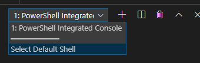
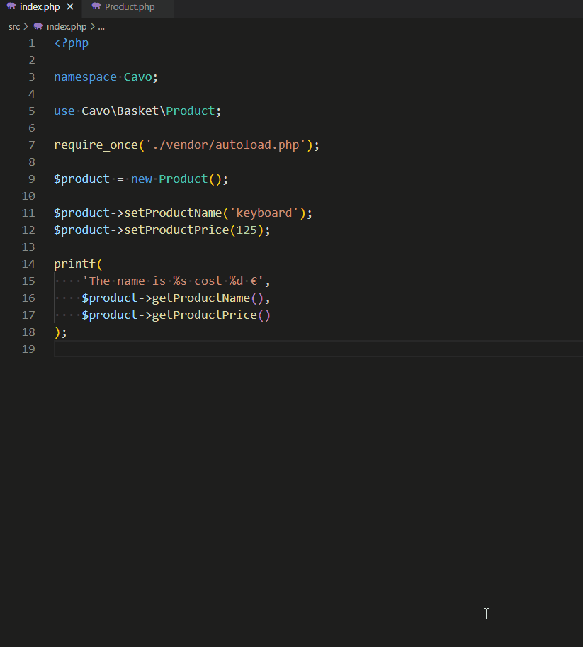
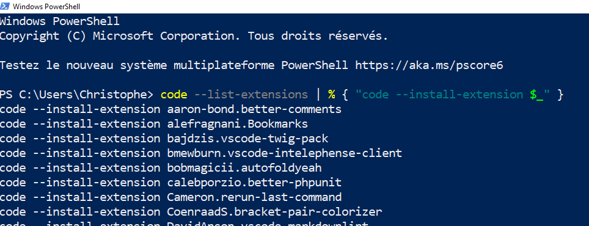
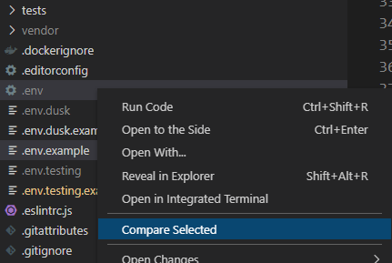
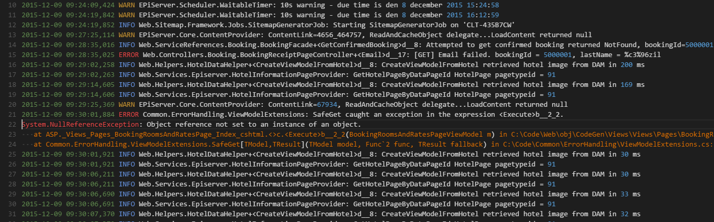
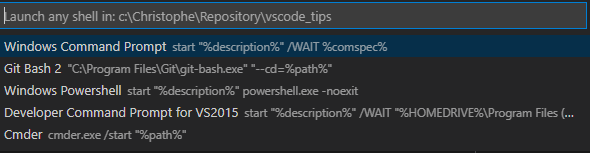
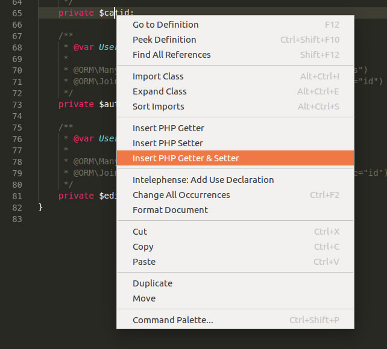
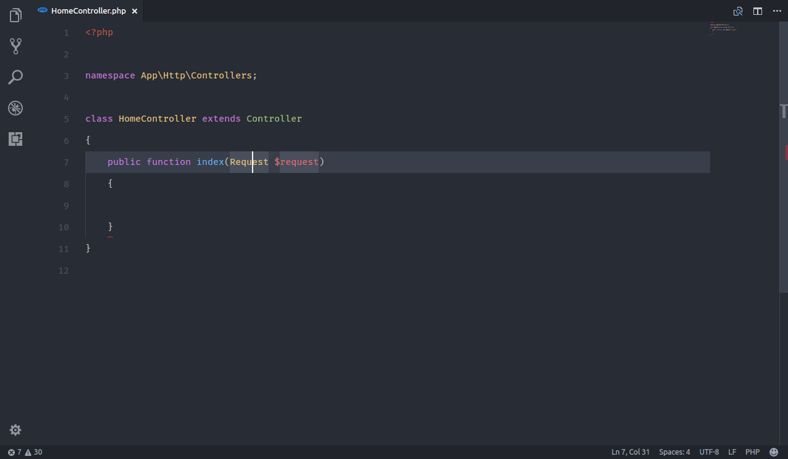

<!-- This file has been generated by the concat.sh script. -->
<!-- Don't modify this file manually (you'll loose your changes) -->
<!-- but run the tool once more -->
<!-- Last refresh date: Friday, August 12, 2022, 09:16:24 -->

---
title: "Visual Studio Code - Tutorial and Tips & Tricks"
subtitle: "Guide for the developer"
date: "12 August 2022, 09:08"
keywords: [vscode, tutorial]
language: "en"
---
<!-- markdownlint-disable MD033 MD041 -->

# Visual Studio Code - Tutorial and Tips & Tricks


> Tutorial and collection of tips and tricks for Visual Studio Code

<!-- table-of-contents - start -->
* [Discovering Visual Studio Code](#discovering) 
  * [Installation](#discovering-installation) 
  * [The first keyboard shortcuts to learn](#discovering-shortcuts) 
  * [Settings](#discovering-settings) 
  * [Working with files and folders](#working-with-files) 
    * [Keyboard shortcuts](#working-with-files-shortcuts) 
  * [Code traversal - Navigation](#traversal) 
    * [Keyboard shortcuts](#traversal-shortcuts) 
    * [Select first](#traversal-select-first) 
  * [Snippets](#snippets) 
    * [Global](#snippets-global) 
      * [Built-in](#snippets-built-in) 
      * [User-defined ones](#snippets-user-defined) 
      * [Make snippets configurable](#snippets-user-placeholders) 
      * [Using variables](#using-variables)
      * [Settings](#snippets-settings) 
      * [Extensions](#snippets-extensions) 
    * [Project-based](#snippets-project-based) 
    * [Generator](#snippets-generator) 
    * [Video tutorial](#snippets-video) 
  * [Using the built-in terminal](#terminal) 
    * [Extensions](#terminal-extensions) 
  * [Search](#search)
    * [Save the search](#save-the-search)
* [Working with code](#working-with-code) 
  * [Keyboard shortcuts](#working-with-code-shortcuts) 
    * [Code folding](#working-with-code-folding) 
    * [Comments](#working-with-code-comments) 
  * [Integrated GIT](#integrated-git) 
    * [Using with the terminal](#integrated-git-terminal) 
    * [Source Control - GIT](#integrated-git-source-control) 
    * [Extensions](#integrated-git-extensions) 
  * [Code definition](#code-definition)
  * [PHP-Unit](#phpunit) 
    * [Extensions](#phpunit-extensions) 
  * [Using xDebug](#xdebug) 
    * [Installation](#installation)
      * [Check if xdebug is loaded](#check-if-xdebug-is-loaded)
    * [Visual Studio Code](#visual-studio-code)
      * [Settings](#settings)
      * [Use inside vscode](#use-inside-vscode)
      * [Breakpoint](#breakpoint)
      * [Logpoint](#logpoint)
      * [Debug keyboard shortcuts](#debug-keyboard-shortcuts)
      * [Also read](#also-read)
  * [PHP Formatting](#php-formatting) 
  * [Multiple cursors](#multiple-cursors) 
    * [Insert prefix on each line](#multiple-cursors-insert-prefix) 
  * [Navigate between problems](#navigate-between-problems)
  * [Regions](#regions)
* [Refactoring](#refactoring)
  * [Renaming](#renaming)
    * [a symbol](#a-symbol)
    * [a class](#a-class)
  * [Extract to a new method](#extract-to-a-new-method)
* [Some settings](#settings) 
  * [Editor settings](#settings-editor) 
  * [Files settings](#settings-files) 
  * [Search settings](#settings-search) 
  * [Telemetry settings](#settings-telemetry) 
  * [Window settings](#settings-window) 
  * [Workbench settings](#settings-workbench) 
* [Extensions](#extensions) 
  * [Unneeded extensions](#unneeded-extensions)
  * [Get the list of all installed extensions {extensions-list-extensions}](#get-the-list-of-all-installed-extensions-extensions-list-extensions)
  * [Bash -  Shellscript](#extensions-sh) 
    * [Shell-format](#extensions-shell-format) 
    * [Shellman](#extensions-shellman) 
  * [Extend core features of Visual Studio Code](#extensions-core) 
    * [Active File In StatusBar](#extensions-active-file-statusbar) 
    * [Autofold](#extensions-autofold) 
    * [Better comments](#extensions-better-comments) 
    * [Bookmarks](#extensions-bookmarks) 
    * [Bracket Pair Colorizer](#extensions-bracket-pair-colorizer) 
    * [Change case](#extensions-change-case) 
    * [Code runner](#extension-code-runner) 
    * [Code Spell Checker](#extensions-code-spell-checker) 
    * [Compare Folders](#extensions-compare-folders) 
    * [Docker](#docker) 
    * [Docker explorer](#docker-explorer) 
    * [EditorConfig](#extensions-editorconfig) 
    * [Favorites](#extensions-favorites) 
    * [git-project-manager](#extensions-git-project-manager) 
    * [Gitlens](#extensions-gitlens) 
    * [Vscode Google Translate](#extensions-google-translate) 
      * [Configuration Google Translate](#configuration-google-translate)
    * [Coloring of source codes according to the language](#extensions-highlight) 
      * [Apache configuration file](#highlight-apache) 
      * [Log File Highlighter](#extensions_log-file-highlighter) 
    * [Prettier](#extensions-prettier-vscode) 
    * [Project Manager](#extensions-project-manager) 
    * [Rerun the last command](#extensions-terminal-rerun) 
    * [REST client](#extensions-rest-client) 
    * [Select highlight in minimap](#extensions-select-highlight-minimap) 
    * [Snippet-creator](#extensions-snippet-creator) 
    * [Sort lines](#extensions-sort-lines) 
    * [Start any shell](#extensions-start-any-shell) 
    * [Surround](#extensions-surround) 
    * [Syncing](#extensions-syncing) 
    * [TabNine](#extensions-tabnine) 
    * [Thunder client](#thunder-client)
    * [Todo Tree](#extensions-todo-tree) 
    * [vscode-icons](#extensions-vscode-icons) 
  * [Javascript](#extensions-javascript) 
    * [ESLint](#extensions-eslint) 
  * [Markdown](#extensions-markdown) 
    * [Emoji](#extensions-emoji) 
    * [Markdown All in One](#extensions-markdown-all-in-one) 
    * [Markdownlint](#extensions-markdownlint) 
      * [Configuration Markdownlint](#extensions-markdownlint-configuration) 
  * [PHP](#extensions-php) 
    * [Better PHPUnit](#extensions-php-better-phpunit) 
      * [Configure](#configure)
      * [Run a test method](#run-a-test-method)
      * [Run a test file](#run-a-test-file)
      * [Run the entire suite](#run-the-entire-suite)
      * [Run the previous test](#run-the-previous-test)
    * [Code-runner](#extensions-php-better-phpunit) 
      * [Configuration Code-runner](#configuration-code-runner)
    * [PHP intelephense](#extensions-php-intelephense) 
      * [Configuration PHP intelephense](#extensions-php-intelephense-configuration) 
    * [Laravel Blade Snippets](#extensions-laravel-blade) 
    * [PHP-CS-FIXER](#extensions-php-cs-fixer) 
    * [PHP DocBlocker](#extensions-php-docblocker) 
    * [PHP Extension Pack](#extensions-php-extension-pack) 
    * [PHP getters and setters](#extensions-php-getters-setters) 
    * [PHP IntelliSense](#extensions-php-intellisense) 
    * [PHP Namespace Resolver {extension-php-namespace-resolver}](#php-namespace-resolver-extension-php-namespace-resolver)
* [Tips](#tips)
  * [editorconfig](#editorconfig)
  * [http://editorconfig.org/](#http-editorconfig-org)
  * [top-most EditorConfig file](#top-most-editorconfig-file)
  * [Interface](#interface)
    * [Use color to identify projects](#use-color-to-identify-projects)
  * [Keyboard shortcuts for Windows](#keyboard-shortcuts-for-windows)
  * [PHP-CS-FIXER](#php-cs-fixer) 
    * [Installation](#php-cs-fixer-installation) 
    * [Remove unused imports](#php-cs-fixer-no-unused-imports) 
  * [Reduce the load time of vscode](#reduce-the-load-time-of-vscode)
    * [Loading from a WSL2 prompt is slow](#loading-from-a-wsl2-prompt-is-slow)
  * [Search and replace - Regex](#search-and-replace-regex)
    * [Remove all lines starting with](#remove-all-lines-starting-with) 
    * [Remove all empty lines](#remove-all-empty-lines)
    * [Remove all lines except those matching a regex](#remove-all-lines-except-those-matching-a-regex)
  * [Custom tasks](#custom-tasks) 
    * [Run a DOS batch](#custom-tasks-batch) 
    * [Run PHP-Unit](#custom-tasks-phpunit) 
    * [Fire the task automatically when the project is opened in vscode](#task-autorun) 
* [Troubleshooting](#troubleshooting) 
  * [Intelephense](#troubleshooting-intelephense) 
  * [Phan](#troubleshooting-phan) 
  * [PHP-CS-FIXER](#troubleshooting-php-cs-fixer) 
    * [PHP General Error](#troubleshooting-php-cs-fixer-php-general-error) 
* [Create your own extension](#own-extension) 
* [Using vscode on the web](#vscode-dev) 
* [Bookmarks](#bookmarks)
  * [VS Code can do that](#vs-code-can-do-that)
  * [VS Code channel on youtube](#vs-code-channel-on-youtube)
* [Annex](#annex)
  * [List of extensions I use](#list-of-extensions-i-use)
* [Trouble shooting](#trouble-shooting)
  * [Git integration is no more working under WSL](#git-integration-is-no-more-working-under-wsl)
* [License](#license)<!-- table-of-contents - end -->

## Discovering Visual Studio Code {#discovering}

### Installation {#discovering-installation}

Download [Visual Studio Code](https://code.visualstudio.com/).

The [Insiders version](https://code.visualstudio.com/insiders/) contains the very latest version but can be unstable.

### The first keyboard shortcuts to learn {#discovering-shortcuts}

* <kbd>CTRL</kbd>-<kbd>B</kbd> toggle visibility of the side bar (the one with the list of files in the project).
* <kbd>CTRL</kbd>-<kbd>O</kbd> to open a file.
* <kbd>CTRL</kbd>-<kbd>K</kbd>-<kbd>CTRL</kbd>-<kbd>O</kbd> to open a folder (a project).
* <kbd>CTRL</kbd>-<kbd>R</kbd> to show the list of recent folders (recent project).
  * **TIP** Before clicking on the desired folder   , be sure to press the <kbd>CTRL</kbd> key to open the folder in a new window ([link](https://github.com/Microsoft/vscode/issues/31581#issuecomment-321753188))
* <kbd>CTRL</kbd>-<kbd>P</kbd> to quickly retrieve and open a file in an open project.
* <kbd>CTRL</kbd>-<kbd>O</kbd> to open a recent folder (a project).
* <kbd>SHIFT</kbd>-<kbd>CTRL</kbd>-<kbd>F</kbd> to open the `search` pane (when a project has been opened).
* <kbd>CTRL</kbd>-<kbd>SHIFT</kbd>-<kbd>P</kbd> to open the `Command Palette` to quick access all commands of the editor.
* <kbd>CTRL</kbd>-<kbd>,</kbd> to get access to the `User Settings`.
* <kbd>CTRL</kbd>-<kbd>SHIFT</kbd>-<kbd>N</kbd> to open a new instance of vscode.
* <kbd>CTRL</kbd>-<kbd>SHIFT</kbd>-<kbd>T</kbd> to reopen a closed file.
* <kbd>CTRL</kbd>-<kbd>SHIFT</kbd>-<kbd>X</kbd> to open the list of `Extensions`.
* <kbd>CTRL</kbd>-<kbd>B</kbd> show/hide the left side-bar (if <kbd>CTRL</kbd>-<kbd>B</kbd> isn't used like in markdown files to set in bold).
* <kbd>CTRL</kbd>-<kbd>K</kbd>-<kbd>Z</kbd> maximize the screen, aka `Zen mode`.

### Settings {#discovering-settings}

There are two sorts of settings: `User` or `Workspace`. Remember, you can quickly access settings thanks the <kbd>CTRL</kbd>-<kbd>,</kbd shortcut.

 `User` settings are for all your projects and stored in the `%APPDATA%\Code\User\settings.json` file.

 `Workspace` settings are the opened project and stored in the `.vscode/settings.json` file (in the project's structure).

### Working with files and folders {#working-with-files}

The most efficient way to do is to use the tree-view at the left and right-click where the file/folder should be created.

Select the parent folder, right-click and select `New file` or `New folder`.

#### Keyboard shortcuts {#working-with-files-shortcuts}

* <kbd>SHIFT</kbd>-<kbd>CTRL</kbd>-<kbd>E</kbd> when a file is opened will activate the tree-view, retrieve the file and highlight it.

### Code traversal - Navigation {#traversal}

#### Keyboard shortcuts {#traversal-shortcuts}

* <kbd>CTRL</kbd>-<kbd>P</kbd> to quick open / go to an open file. Files are sorted in the list from the most recent till the last recent so it's easy to go back to the previously edited file.
* <kbd>CTRL</kbd>-<kbd>P</kbd>-<kbd>CTRL</kbd>-<kbd>P</kbd> to open the most recent file (the second file in the list). You can press CTRL-P again and again to go to the third, fourth, ... When you release keys, the selected file will be immediately open.
* <kbd>CTRL</kbd>-<kbd>SHIFT</kbd>-<kbd>O</kbd> to open (browse) a symbol[^symbol] in the opened file. Navigating with the arrows will select the portion of code in the editor.
* <kbd>CTRL</kbd>-<kbd>T</kbd> to open (browse) a symbol[^symbol] in the entire project. In a markdown file, <kbd>CTRL</kbd>-<kbd>T</kbd> will display the list of every headings f.i.
* <kbd>CTRL</kbd>-<kbd>TAB</kbd> to switch between open tabs (just like Windows and active applications).
* <kbd>CTRL</kbd>-<kbd>K</kbd>-<kbd>CTRL</kbd>-<kbd>Q</kbd> go back to the last edited line.

#### Select first {#traversal-select-first}

* Select a word, a function name, a variable, a constant then press <kbd>CTRL</kbd>-<kbd>T</kbd> to open a list where that selection can be found. For instance, by selecting a constant name and pressing <kbd>CTRL</kbd>-<kbd>T</kbd> you'll obtain the full list of files using that constant and the one who defines the constant.

### Snippets {#snippets}

#### Global {#snippets-global}

##### Built-in {#snippets-built-in}

Snippets are pieces of pre-programmed code (like a `try...catch...`) that allow you to generate code without typing it entirely.

Depending on the open file and its language (php, js, markdown, ...), *VSCode* will offer standard snippets and it will also be possible to program your own.

Press <kbd>CTRL</kbd>-<kbd>SHIFT</kbd>-<kbd>P</kbd> to open the Palette Command then type `Insert Snippet` to get the list of already existing snippets.

##### User-defined ones {#snippets-user-defined}

It is however, possible to write your own snippets: press <kbd>CTRL</kbd>-<kbd>SHIFT</kbd>-<kbd>P</kbd> then `Configure User Snippets`. The programming language is chosen, e.g. `PHP`, which will open an editor with, here, the open `PHP` file.

A file called `php.json` will be open and you can start to create a snippet; f.i.:

```json
{
    "strict": {
        "prefix": "strict",
        "body": ["declare (strict_types = 1);", ""],
        "description": "Add strict_types"
    }
}
```

The code here above defines a snippet called `strict` and it's for a `.php` file. Open such file, start to type `stri` (you can type only a few letters) and press the <kbd>CTRL</kbd>-<kbd>space</kbd> keys. Select the snippet and press <kbd>enter</kbd>. You'll get the code defined in the `body`. It's magic.

Note: you can also desire to just press the <kbd>TAB</kbd> key. If so, check your `User Settings` and make sure the following key is well on `on`:

```json
{
    "editor.tabCompletion": "on"
}
```

The example below will add two snippets, one called `img` and the other one `url`. These snippets are for markdown files so, when adding snippets to VSCode, in the `Configure User Snippets` command, select `markdown` as language first.

```json
{
    "url": {
        "prefix": "url",
        "description": "Add an url tags",
        "body": ["[${1:URL}](${1:URL})"]
    }
}
```

##### Make snippets configurable {#snippets-user-placeholders}

Take a look on the following snippet and the `$1` and `$2` placeholders.

```json
{
    "var-dump": {
        "prefix": "vd",
        "body": [
            "echo '<pre>'.__METHOD__.'--'.__LINE__.'</pre>';",
            "echo '<pre>'.print_r(${1:\\$variableName}, true).'</pre>';",
            "die(${2:\"I'm dying right now\"});"
        ],
        "description": "Debug - Die and echo file/line info"
    }
}
```

Save this snippet in your editor and, in a `php` file, type `vd` followed by <kbd>CTRL</kbd>-<kbd>space</kbd>. You'll get now three new lines and the cursor will be placed where the `$1` placeholder was. Type a PHP variable and press <kbd>TAB</kbd> and see, the cursor will be now immediately put where `$2` was located. Thanks these placeholders it's easy to foresee, in a snippet, locations where you need to type dynamic content like variables, custom text, ...

Tip: use `${1:$variableName}` instead of just `$1` to show a place holder and/or a default value.


##### Using variables

When creating a snippet, we can f.i. use the current PHP filename. Imagine you've a file name `Customer.php` and there you wish to create a new class.

The following snippet will do the magic:

```json
{
    "Class": {
        "prefix": "class",
        "body": ["class ${TM_FILENAME_BASE}", "{", "    return;", "}"],
        "description": "Create a new class"
    }
}
```

The `TM_FILENAME_BASE` variable will be replaced by VS Code to the filename *(without the extension)* so we'll get a new class called `Customer`.

See all variables here: [https://code.visualstudio.com/docs/editor/userdefinedsnippets#_variables](https://code.visualstudio.com/docs/editor/userdefinedsnippets#_variables)

##### Settings {#snippets-settings}

User snippets are stored in the `%APPDATA%\code\user\snippets` folder, one `.json` file by languages.

##### Extensions {#snippets-extensions}

Also see the [snippet-creator](#extensions-snippet-creator) extension.

#### Project-based {#snippets-project-based}

You can also define your snippets for your project and not globally. You can then share snippets with your colleagues f.i.

1. In the root folder of your project create a `.vscode` folder if not yet present;
2. Create a file with the `.code-snippets` extension like `my-project.code-snippets`;
3. You can configure your snippets there.

Below an example from this `VSCode-Tips` project:

```json
{
    "Terminal-shortcut": {
        "scope": "markdown",
        "prefix": "terminal",
        "body": ["`Terminal` (<kbd>CTRL</kbd>-<kbd>SHIFT</kbd>-<kbd>ù</kbd>)"],
        "description": "Show Terminal keyboard Shortcuts"
    }
}
```

Now, each time I'll type `terminal` I can decide to immediately add the keyboard shortcuts; nice.

#### Generator {#snippets-generator}

If you prefer to use a generator, [https://snippet-generator.app/](https://snippet-generator.app/) can help you.

#### Video tutorial {#snippets-video}

[https://www.youtube.com/watch?v=JIqk9UxgKEc](https://www.youtube.com/watch?v=JIqk9UxgKEc)

### Using the built-in terminal {#terminal}

Press <kbd>CTRL</kbd>-<kbd>SHIFT</kbd>-<kbd>ù</kbd> to open the built-in terminal.

Press <kbd>CTRL</kbd>-<kbd>SHIFT</kbd>-<kbd>C</kbd> to open a DOS Prompt session where the current folder will be the opened project.

You can choose for a DOS terminal, Powershell or bash one. Just select the `Select Default Shell` option and VS Code will prompt which shell application should be used.



Note: by clicking on the `+` button, we can create as many terminals we want.

#### Extensions {#terminal-extensions}

Also see the [Rerun last command](#extensions-terminal-rerun) extension.

### Search

#### Save the search

Just after having fired a search, it's possible to click on the `Open in editor` link so the result appears in the editor. The very nice thing then is to be able to see the context (i.e. xxx lines before/after the search match) and to be able to save the search as a file (the filename will be `.code-search`).

This can be useful when f.i. the search pattern is a complex regex or if working on the search result can take a long time so we can save the search as a file in the project and open it later on.


This video show this: [https://www.youtube.com/watch?v=zm7ZjENKUEc](https://www.youtube.com/watch?v=zm7ZjENKUEc)

## Working with code {#working-with-code}

### Keyboard shortcuts {#working-with-code-shortcuts}

#### Code folding {#working-with-code-folding}

* <kbd>CTRL</kbd>-<kbd>K</kbd>-<kbd>CTRL</kbd>-<kbd>à</kbd> to collapse all functions, headings, ... The same can be obtained by <kbd>CTRL</kbd>-<kbd>SHIFT</kbd>-<kbd>P</kbd> then `Fold all`.
* <kbd>CTRL</kbd>-<kbd>K</kbd>-<kbd>CTRL</kbd>-<kbd>J</kbd> to expand all functions, headings, ... The same can be obtained by <kbd>CTRL</kbd>-<kbd>SHIFT</kbd>-<kbd>P</kbd> then `Unfold all`.
* <kbd>CTRL</kbd>-<kbd>K</kbd>-<kbd>CTRL</kbd>-<kbd>&</kbd> - Collapse level 1.
* <kbd>CTRL</kbd>-<kbd>K</kbd>-<kbd>CTRL</kbd>-<kbd>é</kbd> - Collapse level 2.
* <kbd>CTRL</kbd>-<kbd>K</kbd>-<kbd>CTRL</kbd>-<kbd>"</kbd> - Collapse level 3.
* <kbd>CTRL</kbd>-<kbd>K</kbd>-<kbd>CTRL</kbd>-<kbd>'</kbd> - Collapse level 4.
* <kbd>CTRL</kbd>-<kbd>K</kbd>-<kbd>CTRL</kbd>-<kbd>(</kbd> - Collapse level 5.
* <kbd>CTRL</kbd>-<kbd>K</kbd>-<kbd>CTRL</kbd>-<kbd>§</kbd> - Collapse level 6.
* <kbd>CTRL</kbd>-<kbd>K</kbd>-<kbd>CTRL</kbd>-<kbd>è</kbd> - Collapse level 7.
* <kbd>CTRL</kbd>-<kbd>K</kbd>-<kbd>CTRL</kbd>-<kbd>)</kbd> - Collapse the bloc where the cursor is located.

#### Comments {#working-with-code-comments}

Select a bloc of lines then,

* <kbd>CTRL</kbd>-<kbd>K</kbd>-<kbd>CTRL</kbd>-<kbd>C</kbd> to put that bloc in comments (add `//` in front of each line).
* <kbd>CTRL</kbd>-<kbd>K</kbd>-<kbd>CTRL</kbd>-<kbd>U</kbd> to remove the comments (remove `//` in front of each line).

Tip: there is an easier way, <kbd>CTRL</kbd>-<kbd>:</kbd> will toggle (add or remove) comments.

### Integrated GIT {#integrated-git}

#### Using with the terminal {#integrated-git-terminal}

Once a project has been opened, you can get access to any git command by using the terminal. Open the `Terminal` (<kbd>CTRL</kbd>-<kbd>SHIFT</kbd>-<kbd>ù</kbd>).

For instance, if the project has never been sent to git, you can initialize the repository like this:

* Open the `Terminal` (<kbd>CTRL</kbd>-<kbd>SHIFT</kbd>-<kbd>ù</kbd>). You'll be placed in the root folder of the project;
* `git init` to initialize your local repository;
* `git add .` to add all files to the staging area of your repository. Visual Studio Code will change the color of any files and folders in the tree-view to reflect that files are now in the staging area and ready to be committed;
* `git commit -m 'My initial commit'` to commit everything to the local repository. Color in the tree-view will be back in white (no greener) meaning that files are now placed in the repo.;

If you now change a file by appending a new function, removing part of the code, changing a variable, ... VSCode will display a color (green, red, ...) in the left margin of the code editor reflecting the change.

* `git status` in the `Terminal` will show the list of uncommitted changes.

Note: You can get access to any GIT command in the `Command Palette` (<kbd>CTRL</kbd>-<kbd>SHIFT</kbd>-<kbd>P</kbd>).

#### Source Control - GIT {#integrated-git-source-control}

* <kbd>CTRL</kbd>-<kbd>SHIFT</kbd>-<kbd>G</kbd> will open the `Source Control: GIT` pane with the list of changes made to your source after the last `git add` command.

From there it's easy to see what files have been modified and, file by file, discard changes if you want.

#### Extensions {#integrated-git-extensions}

Also see the [Gitlens](#extensions-gitlens) extension.

### Code definition

By right-clicking on a variable, constant or method, we can get access to a few features like showing everywhere it's used.


* <kbd>SHIFT</kbd>-<kbd>F12</kbd> to show all references

In the right area of the popup, we can navigate and click to see each portion of files.

Press <kbd>F12</kbd> to jump in the definition of the method: click or select a method name like in `writeLog(...)` and press <kbd>F12</kbd> once the cursor is located on `writeLog` and you'll jump in the file that implements the method, the method source code will be displayed too.

### PHP-Unit {#phpunit}

From the `Terminal` (<kbd>CTRL</kbd>-<kbd>SHIFT</kbd>-<kbd>ù</kbd>), you can directly run phpunit and the full suite of tests will be executed.


#### Extensions {#phpunit-extensions}

Also see the [Better PHPUnit](#extensions-php-better-phpunit) extension.

### Using xDebug {#xdebug}

URL: [https://xdebug.org](https://xdebug.org/)

> [Tutorial](https://scotch.io/@chenster/debugging-php-in-visual-studio-code205)

#### Installation

* Open `http://localhost/?phpinfo=1` and make <kbd>CTRL</kbd>-<kbd>A</kbd>/<kbd>CTRL</kbd>-<kbd>C</kbd>
* Open `https://xdebug.org/wizard.php` and <kbd>CTRL</kbd><kbd>V</kbd> there
* Click on the `Analyze my phpinfo() output` button

Follow installation steps:

* download the suggested `.dll`,
* save the file in the mentioned location,
* edit `php.ini` and add the reference to the `.dll`
* **extra step**: add the two lines below in the `php.ini` in the `[xdebug]` section

```ini
xdebug.remote_enable = 1
xdebug.remote_autostart = 1
```

* save the file
* restart the webserver

**The two variables below are important and should be initialized to 1 otherwise xdebug will not stop the code on breakpoints.**

##### Check if xdebug is loaded

* Open `http://localhost/?phpinfo=1` once more
* Search for `xdebug`. A  **xdebug** table should be there with a lot of keys/values.

#### Visual Studio Code

Tutorial by Microsoft: `https://code.visualstudio.com/docs/editor/debugging#_launch-configurations`

* Install the [PHP Debug](https://marketplace.visualstudio.com/itemdetails?itemName=felixfbecker.php-debug) extension
* Click on the `bug` button 
* Click on the  dropdown
* Select `Add configuration` and select `PHP` as language
* A list of options can be configured, the list is here: `https://marketplace.visualstudio.com/itemdetails?itemName=felixfbecker.php-debug#supported-launch.json-settings`

##### Settings

Settings are saved in the `/.vscode/launch.json` file. A nice option is the `ignore` one who makes possible to ignore certain files from a debugger perspective. Here, ask not to go into vendors scripts (and stay in our own scripts):

```json
{
    "version": "0.2.0",
    "configurations": [
        {
            "name": "Listen for XDebug",
            "type": "php",
            "request": "launch",
            "port": 9000,
            "ignore": ["**/bin/**/*","**/vendor/**/*"],
            "internalConsoleOptions": "openOnSessionStart"
        }
    ]
}
```

Notes:

* `ignore` is used to indicate to vscode to not stop on any error, exceptions, ... that can be retrieved in specific files or folders. If you're using dependencies, it's a good idea to not stop in files under the `vendor/` folder. Also, if you're using `.phar` archives for instance (let's say in folder `bin/`, it's also a good idea to ignore that folder / files),
* `internalConsoleOptions` will allow to immediately open the debug console in a new terminal, pretty easy.

The list of all settings can be retrieved here: [https://code.visualstudio.com/docs/editor/debugging#_launchjson-attributes](https://code.visualstudio.com/docs/editor/debugging#_launchjson-attributes).

##### Use inside vscode

Open your PHP file and add breakpoints. To do so, click on the line in your code where you want the browser to need to stop and click on the `Debug` menu then click on `Toggle breakpoint`. A red bullet will appear near the line number:


Then, once your breakpoints are in place, click on the `Debug` menu and click then on `Start Debugging`. You'll see an orange panel like the following one:


You'll also have a new toolbar:


Now, go back to your web browser and refresh your URL without any change; if your breakpoints are correctly initialized, the browser will be on *pause* and Visual Studio Code will activate the first met breakpoint.


Use <kbd>F10</kbd> to go to the next instruction or <kbd>F11</kbd> to set into the next instruction (if the instruction is a function, go inside the function).

##### Breakpoint

By adding a breakpoint, it's possible to edit it and set a condition.


##### Logpoint

Instead of writing here and there `echo '...';` or `console.log(...);` statements, VS Code can do it for us:


##### Debug keyboard shortcuts

* Show the Run pane (that pane contains all your variables so you can see, at runtime, their values): <kbd>CTRL</kbd>-<kbd>SHIFT</kbd>-<kbd>D</kbd>
* Toggle breakpoint: <kbd>F9</kbd>
* Step Info: <kbd>F11</kbd>
* Start / Continue: <kbd>F5</kbd>

##### Also read

You can find more information on this repository, from Microsoft: [https://github.com/Microsoft/vscode-recipes/tree/master/PHP](https://github.com/Microsoft/vscode-recipes/tree/master/PHP)

### PHP Formatting {#php-formatting}

If you already have installed [PHP intelephense](#extensions-php-intelephense), you can retrieve a `Format Document` command in the `Command Palette` (<kbd>CTRL</kbd>-<kbd>SHIFT</kbd>-<kbd>P</kbd>) but you can't really configure the rules (how the formatting should be done, tabs or spaces, removed unused classes, ...) and for this reason it's probably best to install [PHP-CS-FIXER]](#extensions-php-cs-fixer).

Once installed, php-cs-fixer will add command like `Fix this file` (<kbd>ALT</kbd>-<kbd>SHIFT</kbd>-<kbd>F</kbd>).

php-cs-fixer can be configured globally (in the `User Settings` (<kbd>CTRL</kbd>-<kbd>,</kbd>)) or for the Workspace (in this case, create or edit the `/.vscode/settings.json` file in your project).

```json
{
    "php-cs-fixer.executablePath": "php-cs-fixer",
    "php-cs-fixer.executablePathWindows": "",
    "php-cs-fixer.onsave": false,
    "php-cs-fixer.rules": "@PSR2",
    "php-cs-fixer.config": ".php_cs;.php_cs.dist",
    "php-cs-fixer.allowRisky": false,
    "php-cs-fixer.pathMode": "override",
    "php-cs-fixer.exclude": [],
    "php-cs-fixer.autoFixByBracket": true,
    "php-cs-fixer.autoFixBySemicolon": false,
    "php-cs-fixer.formatHtml": false,
    "php-cs-fixer.documentFormattingProvider": true
}
```

By creating a `.php-cs` file in your root folder, php-cs-fixer will apply rules defined in that file.

### Multiple cursors {#multiple-cursors}

VSCode supports multiple cursors: click here and there and there but just press the <kbd>CTRL</kbd> key after the first click.

You'll then have more than one cursor and starting type will do it in any places where a cursor was displayed.

For instance, you've a list of public functions, click before each `p` of public functions, press the delete key to remove the `public` word, it'll be done for all functions at a time and type now `private`.

You can also have an enumeration list, one word on each line. Click before each letter and then type `*` to add a bullet before each item.

Really convenient.

The <kbd>CTRL</kbd>-<kbd>D</kbd> shortcut will select the next occurrence: double-click on, f.i., the `public` word to select the first occurrence. Press <kbd>CTRL</kbd>-<kbd>D</kbd> to select the second, the third, and so on. Press <kbd>CTRL</kbd>-<kbd>D</kbd> again and again to select all occurrences. Then type `private` f.i. to overwrite selections and replace by the new word.

I's not really like a `Search` and `Replace all` since here we can decide how many occurrences we wish to replace. It's more interactive.

#### Insert prefix on each line {#multiple-cursors-insert-prefix}

<kbd>SHIFT</kbd>-<kbd>ALT</kbd>-<kbd>I</kbd> allow to enable multiple cursors, a nice use case is to select a bloc of lines and add a bullet so transform lines to a bullet list.

Here is how to do:

1. Select a bloc a line
2. Press <kbd>SHIFT</kbd>-<kbd>ALT</kbd>-<kbd>I</kbd> to enable multiple cursors
3. Press <kbd>Home</kbd> to put cursors at the beginning of each lines,
4. Press <kbd>*</kbd> followed by a space to transform the list of lines to a bullet list.


### Navigate between problems

The list of problems detected by VS Code is displayed in a tab at the bottom of the screen, below the main editor.

You can see the list of problems and navigate between each of them by just pressing <kbd>F8</kbd>.

### Regions

`Regions` are a very smart features to make code editing more readable.

Consider the following function:

```php
<?php

function addRows(array $data): array
{
    $result = [];

    //region 1. Add row only once for the same surveyId/sessionId
    foreach ($data as $participant) {
        // A few dozen lines of code...
        // A few dozen lines of code...
        // A few dozen lines of code...
    }

    //endregion

    //region 2. Add new participants
    try {
        // A few dozen lines of code...
        // A few dozen lines of code...
        // A few dozen lines of code...
    } catch (\Exception $e) {
        // Handle the exception
    }

    //endregion

    //region 3. Prepare resulting array
    // A few dozen lines of code...
    // A few dozen lines of code...
    // A few dozen lines of code...
    // A few dozen lines of code...
    //endregion

    return $result;
}
```

Your function is, logically, divided into three parts; the first to do checks, the second to do the job and the third to prepare the return data.

Using `regions` inside your function make the code's logic really easy to understand.


A very languages didn't support regions, this is the case for `.env` (aka `dotenv`) files. In that case, you can use this addon: [https://github.com/maptz/maptz.vscode.extensions.customfolding](https://github.com/maptz/maptz.vscode.extensions.customfolding).

And now, you can add your own settings like this:

```json
{
    "maptz.regionfolder": {
        "[dotenv]": {
            "foldEnd": "### endregion",
            "foldEndRegex": "^### endregion[\\s]*(.*)",
            "foldStart": "### region",
            "foldStartRegex": "^### region[\\s]*(.*)",
            "disableFolding": false
        }
    }
}
```

## Refactoring

### Renaming

> https://marketplace.visualstudio.com/items?itemName=st-pham.php-refactor-tool

For PHP, for install the `PHP Refactor Tool` addon.

#### a symbol

1. Select a property,
2. Press <kbd>F2</kbd> (or choose `Rename Symbol` in the Command palette (press <kbd>CTRL</kbd>-<kbd>SHIFT</kbd>-<kbd>P</kbd>))
3. Rename the property
4. Select `Update Getter name and Setter name`
5. Press <kbd>Enter</kbd>



Thanks to `PHP Refactor Tool`, all occurrences of the property will be renamed, the getter and the setter and everywhere these functions were used too. In all files of your project.

#### a class

Anywhere in your code (in the class itself or where you use it), select the class name, press <kbd>F2</kbd>, rename it and press <kbd>Enter</kbd>.

The name will be changed everywhere, the name of the file will be changed too as you can see here below.


### Extract to a new method

> [https://marketplace.visualstudio.com/items?itemName=marsl.vscode-php-refactoring](https://marketplace.visualstudio.com/items?itemName=marsl.vscode-php-refactoring)

In a long method, select a block of lines, open the `Command Palette` and run `Extract to a new method`. Then give a name and press <kbd>Enter</kbd>. The method will be created and the extension will pass local variabled if needed to the new method and, if the method initialize a variable, that variable will be returned.


## Some settings {#settings}

### Editor settings {#settings-editor}

Adapts the size of the font used:

```json
{
    "editor.fontSize": 18
}
```

Format the code during a copy/paste:

```json
{
    "editor.formatOnPaste": true
}
```

Format the code when saving:

```json
{
    "editor.formatOnSave": true
}
```

Indentation: tabs or spaces? `true` for spaces, `false` for tabs:

```json
{
    "editor.insertSpaces": false
}
```

Stop displaying the list of open files (top left):

```json
{
    "explorer.openEditors.visible": 0
}
```

Display a grayed out "dot" to make spaces visible:

```json
{
    "editor.renderWhitespace": "all"
}
```

When using snippets, pressing the Tab key will activate the conversion from the shortcut to the content of the snippet:

```json
{
    "editor.tabCompletion": true
}
```

Set the width of a tabulation:

```json
{
    "editor.tabSize": 3
}
```

### Files settings {#settings-files}

Associating certain extensions with programming languages:

```json
{
    "files.associations": {
        ".frm": "html",
        ".php-cs": "php"
    }
}
```

Specifies the default language for new :

```json
{
    "files.defaultLanguage": "PHP"
}
```

Specifies the default format for CRLF (Windows) or LF (Unix) files:

```json
{
    "files.eol": "\n"
}
```

If you don't want to see certain files / folders in your :

```json
{
    "files.exclude": {
        "**/.DS_Store": true,
        "**/.git": true,
        "**/.hg": true,
        "**/.svn": true,
        "**/CVS": true,
        "**/libs/**": true
    }
}
```

### Search settings {#settings-search}

If you want the search feature to ignore certain files / folders :

```json
{
    "search.exclude": {
        "**/bower_components": true,
        "**/node_modules": true,
        "**/libs/**": true
    }
}
```

### Telemetry settings {#settings-telemetry}

Disables telemetry to Microsoft:

```json
{
    "telemetry.enableCrashReporter": false,
    "telemetry.enableTelemetry": false
}
```

### Window settings {#settings-window}

When you open a file and then open another one without modifying the first one, the editor will open the second file in the same tab; the first file will then be closed.

If you want to open each time in a new tab, you have to adapt the parameter below:

```json
{
    "window.openFilesInNewWindow": "on"
}
```

Changes the zoom level:

```json
{
    "window.zoomLevel": 5
}
```

### Workbench settings {#settings-workbench}

Don't display the vertical menu bar on the left side which includes icons for files, search, Git, ...:

```json
{
    "workbench.activityBar.visible": false
}
```

Stop displaying the status bar that appears at the bottom of the screen :

```json
{
    "workbench.statusBar.visible": false
}
```

## Extensions {#extensions}

Some extensions that will be useful for any PHP developer.

### Unneeded extensions

Unneeded because vscode can do the same natively... After each names here below, the setting to enable in VSCode, somes are already enabled by default:

* [Auto Close Tag](https://marketplace.visualstudio.com/items?itemName=formulahendry.auto-close-tag)
    * `"html.autoClosingTags": true,`
    * `"javascript.autoClosingTags": true,`
    * `"typescript.autoClosingTags": true`
* [Auto Import](https://marketplace.visualstudio.com/items?itemName=steoates.autoimport)
    * `"javascript.suggest.autoImports": true,`
    * `"typescript.suggest.autoImports": true,`
    * `"javascript.updateImportsOnFileMove.enabled": "always",`
    * `"typescript.updateImportsOnFileMove.enabled": "always",`
* [Auto Rename Tag](https://marketplace.visualstudio.com/items?itemName=formulahendry.auto-rename-tag)
    * `"editor.renameOnType":true`
* [Settings Sync](https://marketplace.visualstudio.com/items?itemName=Shan.code-settings-sync)
    * See [https://code.visualstudio.com/updates/v1_48#_settings-sync](https://code.visualstudio.com/updates/v1_48#_settings-sync)

### Get the list of all installed extensions {extensions-list-extensions}

You can use vscode on the command line with the `--list-extensions` option to retrieve the list of all installed extensions.

Open a DOS Prompt Session and run `code --list-extensions`. You'll get a list like below:

```text
aaron-bond.better-comments
alefragnani.Bookmarks
bajdzis.vscode-twig-pack
bmewburn.vscode-intelephense-client
bobmagicii.autofoldyeah
calebporzio.better-phpunit
...
```

By running a `Windows Powershell` prompt, you can quickly generate a list of vscode instructions to install all these extensions. Start `Windows Powershell` and run the following command:

```powershell
code --list-extensions | % { "code --install-extension $_" }
```

You'll get a list like below:

```text
code --install-extension aaron-bond.better-comments
code --install-extension alefragnani.Bookmarks
code --install-extension bajdzis.vscode-twig-pack
code --install-extension bmewburn.vscode-intelephense-client
code --install-extension bobmagicii.autofoldyeah
code --install-extension calebporzio.better-phpunit
...
```



Just copy/paste the full output and, f.i. send it by mail to someone. He'll just need to paste the list in a DOS Prompt Session to install them.

### Bash -  Shellscript {#extensions-sh}

#### Shell-format {#extensions-shell-format}

> [https://marketplace.visualstudio.com/items?itemName=foxundermoon.shell-format](https://marketplace.visualstudio.com/items?itemName=foxundermoon.shell-format)

Linter for `.sh` scripts.

#### Shellman {#extensions-shellman}

> [https://marketplace.visualstudio.com/items?itemName=Remisa.shellman](https://marketplace.visualstudio.com/items?itemName=Remisa.shellman)

Shellman provides an impressive list of snippets for Bash. Just start to type something in your code and Shellman will display snippets. Really easy.

The list of supported commands can be retrieved here: [https://github.com/yousefvand/shellman/blob/HEAD/COMMANDS.md](https://github.com/yousefvand/shellman/blob/HEAD/COMMANDS.md)

### Extend core features of Visual Studio Code {#extensions-core}

#### Active File In StatusBar {#extensions-active-file-statusbar}

> [https://marketplace.visualstudio.com/items?itemName=RoscoP.ActiveFileInStatusBar](https://marketplace.visualstudio.com/items?itemName=RoscoP.ActiveFileInStatusBar)

Displays the full name of the file being edited at the bottom of the screen and allows, for example, to copy/paste its name by clicking on it.


#### Autofold {#extensions-autofold}

> [https://marketplace.visualstudio.com/items?itemName=bobmagicii.autofoldyeah](https://marketplace.visualstudio.com/items?itemName=bobmagicii.autofoldyeah)

By opening a file, the autofold extension can automatically collapse docblocks, functions, ...

The level (collapse all, from the second, third, ... level) can be configured for each file extension separately.

Here is a sample: by opening that source file, comments and function code is collapsing automatically, we've directly a better view on what that file is doing.


#### Better comments {#extensions-better-comments}

> [https://marketplace.visualstudio.com/items?itemName=aaron-bond.better-comments](https://marketplace.visualstudio.com/items?itemName=aaron-bond.better-comments)

The Better Comments extension will help you create more human-friendly comments in your code.


#### Bookmarks {#extensions-bookmarks}

> [https://marketplace.visualstudio.com/items?itemName=alefragnani.Bookmarks](https://marketplace.visualstudio.com/items?itemName=alefragnani.Bookmarks)

Allows you to put files in a bookmark folder, displayed in the icon bar on the left. This allows you to jump very quickly to a file, to a specific line (which would have been bookmarked).

#### Bracket Pair Colorizer {#extensions-bracket-pair-colorizer}

**NO MORE REQUIRED, NOW CORE IN VSCODE 1.60: [https://code.visualstudio.com/updates/v1_60#_high-performance-bracket-pair-colorization](https://code.visualstudio.com/updates/v1_60#_high-performance-bracket-pair-colorization)**

#### Change case {#extensions-change-case}

> [https://marketplace.visualstudio.com/items?itemName=wmaurer.change-case](https://marketplace.visualstudio.com/items?itemName=wmaurer.change-case)

Easily change the case of variable names; like switching to pascal case, camelCase, CONSTANT, ...


#### Code runner {#extension-code-runner}

> [https://marketplace.visualstudio.com/items?itemName=formulahendry.code-runner](https://marketplace.visualstudio.com/items?itemName=formulahendry.code-runner)

With Code runner, open a supported code source (like PHP or Python) and press  <kbd>CTRL</kbd>-<kbd>SHIFT</kbd>-<kbd>R</kbd> to run that code and get the result in the console. You even don't need to save the file.


#### Code Spell Checker {#extensions-code-spell-checker}

> [https://marketplace.visualstudio.com/items?itemName=streetsidesoftware.code-spell-checker](https://marketplace.visualstudio.com/items?itemName=streetsidesoftware.code-spell-checker)

A basic spell checker that works well with camelCase code.

The goal of this spell checker is to help catch common spelling errors while keeping the number of false positives low.


#### Compare Folders {#extensions-compare-folders}

> [https://marketplace.visualstudio.com/items?itemName=moshfeu.compare-folders](https://marketplace.visualstudio.com/items?itemName=moshfeu.compare-folders)

You'll not need `winMerge` (Windows) anymore.

Just select the two files (or folders) you want to compare, make a right click on a file and select `Compare Selected`.



#### Docker {#docker}

> [https://marketplace.visualstudio.com/items?itemName=ms-azuretools.vscode-docker](https://marketplace.visualstudio.com/items?itemName=ms-azuretools.vscode-docker)

Microsoft extension for Docker that will make working with Docker easier.


You'll get a new button in the left navigation sidebar to see a lot of features like getting the list of running containers (with start / stop / remove actions), the list of images, the list of volumes, ...

You'll also get linting feature for files like `Dockerfile` or `docker-compose.yml` and many more.

#### Docker explorer {#docker-explorer}

> [https://marketplace.visualstudio.com/items?itemName=formulahendry.docker-explorer](https://marketplace.visualstudio.com/items?itemName=formulahendry.docker-explorer)

This extension will allows you to code inside a container, what Microsoft called `Remote containers`.

You'll need to have a `.devcontainer.json` file for this (see [https://code.visualstudio.com/docs/remote/remote-overview](https://code.visualstudio.com/docs/remote/remote-overview)).

When installed, as soon as the `devcontainer.json` file is detected by vscode, you'll be prompted to reopen the project remotely. You can also press <kbd>CTRL</kbd>-<kbd>SHIFT</kbd>-<kbd>P</kbd> to open the *Command Palette* and select `Remote-Containers: Reopen in Container`.

#### EditorConfig {#extensions-editorconfig}

> [https://github.com/editorconfig/editorconfig-vscode](https://github.com/editorconfig/editorconfig-vscode)

EditorConfig extension for Visual Studio Code [https://editorconfig.org/](https://editorconfig.org/)

#### Favorites {#extensions-favorites}

> [https://marketplace.visualstudio.com/items?itemName=kdcro101.favorites](https://marketplace.visualstudio.com/items?itemName=kdcro101.favorites)

Allows you to group shortcuts to files that, for example, you often have to open.


#### git-project-manager {#extensions-git-project-manager}

> [https://github.com/felipecaputo/git-project-manager](https://github.com/felipecaputo/git-project-manager)

A Git Project Manager extension for vsCode.

Using GPM, it's now really easy to open a project: just press <kbd>CTRL</kbd>-<kbd>P</kbd> to open the Command Palette and select `GPM: Open Git Project`. Then you'll get the list of all folders on your disk with Git repositories.

First, you'll need to configure the `gitProjectManager.baseProjectsFolders` setting with the list of directories with your project; let's say `C:\Christophe\Repository`. You can mention several folders if you desire to.

You can also specify a root folder and playing with the `gitProjectManager.maxDepthRecursion` setting, you can define the recursion (*the higher the number, the slower the system will be to retrieve the list of projects*).

```json
{
    "gitProjectManager.baseProjectsFolders": [
        "C:\\Christophe\\Repository"
    ],
    "gitProjectManager.storeRepositoriesBetweenSessions": true,
    "gitProjectManager.ignoredFolders": ["node_modules","vendor"],
    "gitProjectManager.maxDepthRecursion": 2,
    "gitProjectManager.checkRemoteOrigin": false,
    "gitProjectManager.openInNewWindow": false
}
```


#### Gitlens {#extensions-gitlens}

> [https://github.com/eamodio/vscode-gitlens](https://github.com/eamodio/vscode-gitlens)

Supercharge the Git capabilities built into Visual Studio Code — Visualize code authorship at a glance via Git blame annotations and code lens, seamlessly navigate and explore Git repositories, gain valuable insights via powerful comparison commands, and so much more


#### Vscode Google Translate {#extensions-google-translate}

> [https://marketplace.visualstudio.com/items?itemName=funkyremi.vscode-google-translate](https://marketplace.visualstudio.com/items?itemName=funkyremi.vscode-google-translate)

Quickly translate text right in your code.


##### Configuration Google Translate

By setting your preferred language, you'll not be prompted each time about the target language.

```json
{
    "vscodeGoogleTranslate.preferredLanguage": "fr"
}
```

Also, it's best to assign keyboard shortcut like <kbd>ALT</kbd>-<kbd>SHIFT</kbd>-<kbd>T</kbd> to translate the text.

```json
{
    "key": "shift+alt+t",
    "command": "extension.translateTextPreferred"
}
```

#### Coloring of source codes according to the language {#extensions-highlight}

##### Apache configuration file {#highlight-apache}

> [https://marketplace.visualstudio.com/items?itemName=mrmlnc.vscode-apache](https://marketplace.visualstudio.com/items?itemName=mrmlnc.vscode-apache)

Support (coloring) Apache files such as `.htaccess`, `.htpasswd`, `.conf` and `.htgroups`.


##### Log File Highlighter {#extensions_log-file-highlighter}

> [https://marketplace.visualstudio.com/items?itemName=emilast.LogFileHighlighter](https://marketplace.visualstudio.com/items?itemName=emilast.LogFileHighlighter)

Log file highlight.



#### Prettier {#extensions-prettier-vscode}

> [https://marketplace.visualstudio.com/items?itemName=esbenp.prettier-vscode](https://marketplace.visualstudio.com/items?itemName=esbenp.prettier-vscode)

Prettier is an opinionated code formatter. It enforces a consistent style by parsing your code and re-printing it with its own rules that take the maximum line length into account, wrapping code when necessary.

#### Project Manager {#extensions-project-manager}

> [https://marketplace.visualstudio.com/items?itemName=alefragnani.project-manager](https://marketplace.visualstudio.com/items?itemName=alefragnani.project-manager)

Easily switch between projects.


#### Rerun the last command {#extensions-terminal-rerun}

[https://marketplace.visualstudio.com/items?itemName=Cameron.rerun-last-command](https://marketplace.visualstudio.com/items?itemName=Cameron.rerun-last-command)

Quickly repeat the last command in your terminal without leaving the text editor.

Just press <kbd>CTRL</kbd>-<kbd>F7</kbd> to rerun it.


#### REST client {#extensions-rest-client}

> [https://marketplace.visualstudio.com/items?itemName=humao.rest-client](https://marketplace.visualstudio.com/items?itemName=humao.rest-client)

Make easy to debug JSON API without leaving the IDE.

#### Select highlight in minimap {#extensions-select-highlight-minimap}

> [https://marketplace.visualstudio.com/items?itemName=mde.select-highlight-minimap](https://marketplace.visualstudio.com/items?itemName=mde.select-highlight-minimap)

Highlights the selected code (e.g. a function name) in the minimap so that you can quickly identify where in the currently edited file the same function is called.


#### Snippet-creator {#extensions-snippet-creator}

The [snippet-creator](https://marketplace.visualstudio.com/items?itemName=nikitaKunevich.snippet-creator) extension simplifies the creation of a snippet from existing code. Simply select the code already present in a file and then do a <kbd>CTRL</kbd>-<kbd>SHIFT</kbd>-<kbd>P</kbd>, type `Create Snippet` to call the wizard.

*Note: the extension is actually deprecated (may 2020).*

#### Sort lines {#extensions-sort-lines}

> [https://marketplace.visualstudio.com/items?itemName=Tyriar.sort-lines](https://marketplace.visualstudio.com/items?itemName=Tyriar.sort-lines)

Sorts lines of text.


#### Start any shell {#extensions-start-any-shell}

> [https://github.com/remcoros/vscode-startanyshell](https://github.com/remcoros/vscode-startanyshell)

Press <kbd>CTRL</kbd>-<kbd>SHIFT</kbd>-<kbd>C</kbd> to start a shell like DOS Prompt, Windows Powershell or Git Bash. The startup folder will be the root of your project.

So easy to run DOS batch, powershell or Bash scripts or any other commands (git, composer, ...).



#### Surround {#extensions-surround}

> [https://marketplace.visualstudio.com/items?itemName=yatki.vscode-surround](https://marketplace.visualstudio.com/items?itemName=yatki.vscode-surround)

We select a block of lines of code and then, thanks to Surround, we can include it in an `if/else`, `try/catch`, ... The tool indents the code itself.


#### Syncing {#extensions-syncing}

Synchronization is now (August 2020) part of Visual Studio Code: [https://code.visualstudio.com/docs/editor/settings-sync](https://code.visualstudio.com/docs/editor/settings-sync)

#### TabNine {#extensions-tabnine}

AMAZING code completion extension.

TabNine is using AI to learn how you are using vscode (no matter the used language) and will predict the next words.

This addon is really a MUST HAVE: [https://marketplace.visualstudio.com/items?itemName=TabNine.tabnine-vscode](https://marketplace.visualstudio.com/items?itemName=TabNine.tabnine-vscode)

#### Thunder client

> A pure wonder

Thunder Client is a lightweight Rest API Client Extension for VS Code.

[https://github.com/rangav/thunder-client-support/](https://github.com/rangav/thunder-client-support/)

Without leaving vscode, you'll be able to test your REST API.


#### Todo Tree {#extensions-todo-tree}

> [https://marketplace.visualstudio.com/items?itemName=Gruntfuggly.todo-tree](https://marketplace.visualstudio.com/items?itemName=Gruntfuggly.todo-tree)

Displays an icon on the left side of the screen, in the form of a tree, which allows you to find, in one place, the list of TODOs that you have to make, i.e. comments beginning with `// TODO` that have been encoded in the source files.


#### vscode-icons {#extensions-vscode-icons}

> [https://marketplace.visualstudio.com/items?itemName=robertohuertasm.vscode-icons](https://marketplace.visualstudio.com/items?itemName=robertohuertasm.vscode-icons)

Adapt the tree-view with the list of files to use an icon associated to the type of file (css, html, php, ...)


### Javascript {#extensions-javascript}

#### ESLint {#extensions-eslint}

> [https://marketplace.visualstudio.com/items?itemName=dbaeumer.vscode-eslint](https://marketplace.visualstudio.com/items?itemName=dbaeumer.vscode-eslint)

Javascript linter

### Markdown {#extensions-markdown}

#### Emoji {#extensions-emoji}

> [https://marketplace.visualstudio.com/items?itemName=perkovec.emoji](https://marketplace.visualstudio.com/items?itemName=perkovec.emoji)

Insert an emoji without leaving the editor. The


#### Markdown All in One {#extensions-markdown-all-in-one}

> [https://marketplace.visualstudio.com/items?itemName=yzhang.markdown-all-in-one](https://marketplace.visualstudio.com/items?itemName=yzhang.markdown-all-in-one)

Implements keyboard shortcuts for the Markdown language allows the generation of tables of contents, preview, ...

#### Markdownlint {#extensions-markdownlint}

* [https://github.com/DavidAnson/vscode-markdownlint](https://github.com/DavidAnson/vscode-markdownlint)

##### Configuration Markdownlint {#extensions-markdownlint-configuration}

You can configure markdownlint to ignore some files or some rules.

The list of rules can be retrieved from [https://github.com/DavidAnson/markdownlint/blob/master/doc/Rules.md](https://github.com/DavidAnson/markdownlint/blob/master/doc/Rules.md).

To ignore f.i. rules `MD033` and `MD041`, just add the following configuration in your `settings.json` file:

```json
{
    "markdownlint.config": {
        "MD033": false,
        "MD041": false
    }
}
```

To ignore files use the `ignore` key:

```json
{
    "markdownlint.config": {
        "ignore": ["!**/History.md"]
    }
}
```

Set your custom rules:

```json
{
    "markdownlint.customRules": ["C:\\Christophe\\.config\\.markdownlint.json"]
}
```

### PHP {#extensions-php}

#### Better PHPUnit {#extensions-php-better-phpunit}

> [https://github.com/calebporzio/better-phpunit](https://github.com/calebporzio/better-phpunit)

Better PHPUnit is the most popular, cleanest, and fastest PHPUnit runner for VS Code.


##### Configure

Make sure to edit the `Workspace` settings and add these two keys:

{
    "better-phpunit.phpunitBinary": "c:\\your_project\\vendor\\bin\\phpunit.bat",
    "better-phpunit.xmlConfigFilepath": "c:\\your_project\\phpunit.xml"
}

Should be the absolute path to the `phpunit.bat` file and your `phpunit.xml` configuration file.

##### Run a test method

* Place your cursor in/on the method you want to run
* <kbd>CTRL</kbd>-<kbd>SHIFT</kbd>-<kbd>P</kbd> to open the `Command Palette`
* Select: `Better PHPUnit: run` (<kbd>CTRL</kbd>-<kbd>K</kbd>-<kbd>CTRL</kbd>-<kbd>R</kbd>)

##### Run a test file

* <kbd>CTRL</kbd>-<kbd>SHIFT</kbd>-<kbd>P</kbd> to open the `Command Palette`
* Select: `Better PHPUnit: run-file` (<kbd>CTRL</kbd>-<kbd>K</kbd>-<kbd>CTRL</kbd>-<kbd>F</kbd>)

##### Run the entire suite

* <kbd>CTRL</kbd>-<kbd>SHIFT</kbd>-<kbd>P</kbd> to open the `Command Palette`
* Select: `Better PHPUnit: run suite`

##### Run the previous test

* <kbd>CTRL</kbd>-<kbd>SHIFT</kbd>-<kbd>P</kbd> to open the `Command Palette`
* Select: `Better PHPUnit: run previous` (<kbd>CTRL</kbd>-<kbd>K</kbd>-<kbd>CTRL</kbd>-<kbd>P</kbd>)

#### Code-runner {#extensions-php-better-phpunit}

> [https://github.com/formulahendry/vscode-code-runner](https://github.com/formulahendry/vscode-code-runner)

With code-runner, open a PHP file and just run it from within vscode. Useful to run samples scripts f.i.

##### Configuration Code-runner

Be sure to enable the `fileDirectoryAsCwd` setting. This will force `code-runner` to run the script by first setting the current directory to the one of the PHP file. Needed to make sure your require (like your autoloader) statements can retrieve files.

{
    "code-runner.clearPreviousOutput": true,
    "code-runner.defaultLanguage": "php",
    "code-runner.enableAppInsights": false,
    "code-runner.fileDirectoryAsCwd": true
}

#### PHP intelephense {#extensions-php-intelephense}

> [https://github.com/bmewburn/vscode-intelephense](https://github.com/bmewburn/vscode-intelephense)

##### Configuration PHP intelephense {#extensions-php-intelephense-configuration}

After installation, we need to disable the built-in PHP feature of VSCode.

1. Go to the extensions tab (<kbd>CTRL</kbd>-<kbd>SHIFT</kbd>-<kbd>X</kbd>)
2. Search for `@builtin php`
3. Select `PHP Language Features`
4. Disable it.

#### Laravel Blade Snippets {#extensions-laravel-blade}

> [https://marketplace.visualstudio.com/items?itemName=onecentlin.laravel-blade](https://marketplace.visualstudio.com/items?itemName=onecentlin.laravel-blade)

Helper for working with Laravel Blade templates.

#### PHP-CS-FIXER {#extensions-php-cs-fixer}

> [https://marketplace.visualstudio.com/items?itemName=junstyle.php-cs-fixer](https://marketplace.visualstudio.com/items?itemName=junstyle.php-cs-fixer)

Automatic correction of the quality of PHP code formatting thanks to quality standards (e.g. PSR2), which can be overloaded through a configuration file.

Once installed, go to the `Command Palette` (<kbd>CTRL</kbd>-<kbd>SHIFT</kbd>-<kbd>P</kbd>) and select `php-cs-fixer: fix this file` to correctly format the file.

Note: you can add PHP-CS-FIXER as a global dependency (thus for all your projects) by running `composer require friendsofphp/php-cs-fixer global` on the command line.

php-cs-fixer is using a `.php-cs` file for his configuration; there are a lot of items that can be configured. See [https://github.com/FriendsOfPHP/PHP-CS-Fixer](https://github.com/FriendsOfPHP/PHP-CS-Fixer) for more information's.

#### PHP DocBlocker {#extensions-php-docblocker}

> [https://marketplace.visualstudio.com/items?itemName=neilbrayfield.php-docblocker](https://marketplace.visualstudio.com/items?itemName=neilbrayfield.php-docblocker)

Allows generating documentation blocks of classes, methods, ...

Essential extension for any PHP programmer because it allows generating docblocks to document methods, properties, constants, ... in a PHP source code.


#### PHP Extension Pack {#extensions-php-extension-pack}

> [https://marketplace.visualstudio.com/items?itemName=felixfbecker.php-pack](https://marketplace.visualstudio.com/items?itemName=felixfbecker.php-pack)

Includes the most important extensions to get you started with PHP development in Visual Studio Code.

#### PHP getters and setters {#extensions-php-getters-setters}

> [https://github.com/phproberto/vscode-php-getters-setters](https://github.com/phproberto/vscode-php-getters-setters)

Create a new property in your class; right-click on it and choose `Insert PHP Getter & Setter` to generate PHP code for both actions.

Really easy...



The extension can be configured (see [https://github.com/phproberto/vscode-php-getters-setters#extension-settings](https://github.com/phproberto/vscode-php-getters-setters#extension-settings)) and, if you wish, you can redefine the code of the Setter for instance (as an example, you can decide not to return the value).

#### PHP IntelliSense {#extensions-php-intellisense}

> [https://marketplace.visualstudio.com/items?itemName=felixfbecker.php-intellisense](https://marketplace.visualstudio.com/items?itemName=felixfbecker.php-intellisense)

Advanced PHP IntelliSense for Visual Studio Code.


#### PHP Namespace Resolver {extension-php-namespace-resolver}

> [https://marketplace.visualstudio.com/items?itemName=MehediDracula.php-namespace-resolver](https://marketplace.visualstudio.com/items?itemName=MehediDracula.php-namespace-resolver)

In a PHP file, right-click on a class name and PHP Namespace Resolver will search where that class is defined (based on your `composer.json` file). If there is only one occurrence, the class will be immediately added in a `use` command. Otherwise, you'll be prompted to select the desired one.



## Tips

### editorconfig

> [https://editorconfig.org](https://editorconfig.org)

Just place a file like the one below in your project folder or **any parent folder**. The file should be named `.editorconfig`.

There is **nothing** to do in VSCode except installing the [extension](https://marketplace.visualstudio.com/items?itemName=EditorConfig.EditorConfig). There is no settings... The extension will automatically check for the presence of the `.editorconfig` file in the project folder or any parent folder. If a file is found, if the `root = true` line is in it, the extension knows that this is the final file.

So we can have a file in our project folder without the root statement for overriding some features and a global file in the parent folder.

```text
### http://editorconfig.org/

### top-most EditorConfig file
root = true

[*]
charset = utf-8
indent_style = spaces
indent_size = 4
end_of_line = lf
trim_trailing_whitespace = true
insert_final_newline = true

[*.md]
trim_trailing_whitespace = false

[*.Markdown]
trim_trailing_whitespace = false
```

### Interface

#### Use color to identify projects

Colors have to be set in the `.vscode/settings.json` file in the project root folder; example:

```json
{
    "workbench.colorCustomizations": {
        "titleBar.activeBackground": "#f3a2bc",
        "titleBar.inactiveBackground": "#FF2CCC",
        "titleBar.activeForeground": "#0e0b0b",
        "titleBar.inactiveForeground": "#FFF000"
    }
}
```

To open that setting file, just go to your `Workspace settings` page.


Tips:

* Install [Peacock](https://marketplace.visualstudio.com/items?itemName=johnpapa.vscode-peacock) to make changes easily. Peacock will use some default schemas or allow to choose a random one.
* you can use a tool like [https://contrastchecker.com/](https://contrastchecker.com/) to find a good contrast schema.
* You can also deeper in the configuration of the editor; please take a look to [https://code.visualstudio.com/api/references/theme-color](https://code.visualstudio.com/api/references/theme-color)

Happy coloring 😉

### Keyboard shortcuts for Windows

* Cheat sheet for Windows users: [https://code.visualstudio.com/shortcuts/keyboard-shortcuts-windows.pdf](https://code.visualstudio.com/shortcuts/keyboard-shortcuts-windows.pdf)
* [Online and interactive tutorial](https://www.shortcutfoo.com/app/dojos/vscode-win)

### PHP-CS-FIXER {#php-cs-fixer}

The use of [php-cs-fixer](https://github.com/FriendsOfPHP/PHP-CS-Fixer) can help to maintain a proper code. More info below.

#### Installation {#php-cs-fixer-installation}

Install [PHP-CS-FIXER](https://github.com/FriendsOfPHP/PHP-CS-Fixer)<https://github.com/FriendsOfPHP/PHP-CS-Fixer.>

Create your `php-cs-fixer.php` file and put it there your settings. More info below.

Open VSCode, go to the settings page (press <kbd>CTRL</kbd>-<kbd>,</kbd>), search for `php-cs-fixer.config` and initialize the settings to the path of your `php-cs-fixer.php` (f.i. `C:\\config\\php-cs-fixer.php`).

#### Remove unused imports {#php-cs-fixer-no-unused-imports}

The `no_unused_imports` setting, when set to `true`, allow php-cs-fixer to detect unused imports like below and to remove it automatically.

```php
<?php

require 'vendor/autoload.php';

use Avonture\Pandoc;

echo __DIR__;
```

This is done when you'll save your file.

```php
<?php
return PhpCsFixer\Config::create()
    ->setRules([
        'no_unused_imports'=> true
    ]);
```

### Reduce the load time of vscode

You've installed some addons and at given time period, you're suffering on *Damned, vscode takes a lot of time to load my project*.

Press <kbd>CTRL</kbd>-<kbd>P</kbd> to open the palette and run `Developer: Show Running Extensions`.

You'll get a screen like the one below, extensions are ordered by the slowest one.

In my case, I like to use `Compare Folders` but no so often so it's best to disabled it and enable it again only on a need base. Same for `Code Runner`. By disabling these two, I earn 4 seconds each time I start vscode a day (and I start it so much for all my projects).


#### Loading from a WSL2 prompt is slow

> [https://stackoverflow.com/questions/66310913/vscode-with-wsl2-delayed-launching-due-to-no-response-to-ping](https://stackoverflow.com/questions/66310913/vscode-with-wsl2-delayed-launching-due-to-no-response-to-ping)
> [https://github.com/microsoft/vscode-remote-release/issues/4888](https://github.com/microsoft/vscode-remote-release/issues/4888)

If, running `code .` from a WSL2 prompt is slow, try to set the `remote.WSL.server.connectThroughLocalhost` global setting to `true`.

The problem comes from an internal ping done by VSCode on the IP of your machine and in some situation like working on a virtual machine, the ping will be blocked and vscode will wait one minute before throwing a timeout.

Loosing that minute of time can be avoided thanks the `remote.WSL.server.connectThroughLocalhost` setting.

### Search and replace - Regex

#### Remove all lines starting with 

Imagine you want to remove all commented lines and the character used for comments is a `#` so you want to remove lines starting with `#`.

* Search `^#.*[\n|\r]*`
* Replace by *let this field empty*

The regex means: 

* `^#`: we want all lines starting with `#`
* `.*`: followed by any character
* `[\n|\r]*`: and followed by one or more carriage return / linefeed.

#### Remove all empty lines

> [https://dev.to/gyurisc/easily-remove-empty-lines-using-regular-expression-in-visual-studio-code-1230](https://dev.to/gyurisc/easily-remove-empty-lines-using-regular-expression-in-visual-studio-code-1230)

* Search `^(?:[\t]*(?:\r?\n|\r))+`
* Replace by *let this field empty*


#### Remove all lines except those matching a regex

Imagine you've a big JSON file with f.i. a list of users like this:

```json
[
    {
        "name": "Leanne Graham",
        "username": "Bret",
        "email": "Sincere@april.biz"
    },
    {
        "name": "Ervin Howell",
        "username": "Antonette",
        "email": "Shanna@melissa.tv"
    },
    {
        "name": "Clementine Bauch",
        "username": "Samantha",
        "email": "Nathan@yesenia.net"
    },
    {
        "name": "Patricia Lebsack",
        "username": "Karianne",
        "email": "Julianne.OConner@kory.org"
    },
    {
        "name": "Chelsey Dietrich",
        "username": "Kamren",
        "email": "Lucio_Hettinger@annie.ca"
    }
]
```

From that list you wish to keep only lines with emails.

The idea is to use a regex expression so we can match email lines and use a negative search so not email lines are selected:

To match email lines (with the carriage return at the end), we'll use `.*email.*\n`.

For the use case, we'll search for `.*email.*\n` and replace by nothing: emails lines will be removed in the entire file.


Using the negative regex `^(?!.*email).*$\n` will match all lines except the ones containing the email word and, here too, if we search and replace by nothing, we'll remove all lines except emails:


<!-- markdownlint-disable MD033 -->

### Custom tasks {#custom-tasks}

> [https://code.visualstudio.com/docs/editor/tasks](https://code.visualstudio.com/docs/editor/tasks)
>
> [https://code.visualstudio.com/docs/editor/variables-reference](https://code.visualstudio.com/docs/editor/variables-reference)

By creating a  `./.vscode/tasks.json`, it's possible to add custom tasks to Visual Studio Code.

A custom task can be running PHP Unit tests or any other shell commands.

#### Run a DOS batch {#custom-tasks-batch}

The following example define a task called `concat-md`, it's a shell command (i.e. a DOS task).

```json
{
    "version": "2.0.0",
    "tasks": [
        {
            "label": "concat-md",
            "type": "shell",
            "command": "${workspaceFolder}/concat-md.cmd",
            "group": "build",
            "presentation": {
                "reveal": "always"
            },
            "problemMatcher": []
        }
    ]
}
```

Note: `${workspaceFolder}` has been used instead of just `./concat-md.cmd` to make sure vscode will use the file from the repo's root folder.

To run that task, we just need to call the `Command Palette` (<kbd>CTRL</kbd>-<kbd>SHIFT</kbd>-<kbd>P</kbd>) then select `Tasks: Run task`. You'll then be prompted to select the task and `concat-md` will appear.

All your custom tasks will be accessible in the `Tasks: Run task` list.

Tip: it's possible to specify more than one command using the `&&` syntax; f.i. `"command": "cd tests/ && run_all.cmd",`


#### Run PHP-Unit {#custom-tasks-phpunit}

Another example can be to run PHP Unit with some command-line options.

The example below defines a `phpunit: run tests\Api` task so we can execute all tests under the `Api` folder. We can of course use any command line options supported by PHP Unit.

```json
{
	"version": "2.0.0",
	"tasks": [
        {
            "label": "phpunit: run tests\\Api",
            "type": "process",
            "command": "${workspaceFolder}\\vendor\\bin\\phpunit.bat",
            "args": [
                "${workspaceFolder}\\tests\\Api"
            ],
            "presentation": {
                "echo": true,
                "panel":"new"
            },
            "problemMatcher": []
        }
    ]
}
```

Note: the `type` defined in the JSON file is `process`, this means that the defined `command` will be executed within vscode, in the `Terminal`. The process should then be an executable and any parameters have to be defined in the `args` array;

#### Fire the task automatically when the project is opened in vscode {#task-autorun}

When you define a task with the following setting, that task can be fired automatically by VSCode during the opening of the editor.

```json
"runOptions": {
    "runOn": "folderOpen"
}
```

In the complete example below, the `docker-up.bat` is a DOS script that will set-up `Docker` for my project.

```json
{
    "label": "Docker-up ",
    "type": "shell",
    "command": "docker-up.bat",
    "problemMatcher": [],
    "presentation": {
        "echo": true,
        "reveal": "always",
        "focus": false,
        "panel": "dedicated",
        "showReuseMessage": true,
        "clear": true
    },
    "runOptions": {
        "runOn": "folderOpen"
    }
}
```

In VSCode, we need to

1. Press <kbd>CTRL</kbd>-<kbd>SHIFT</kbd>-<kbd>P</kbd> to open the `Command Palette`.
2. Search for `Tasks: Manage Auotomatic Tasks in Folder`,
3. Select `Allow Automatic Tasks in Folder`

So we allow VSCode to run automatic tasks for that project.

Then:

1. Press <kbd>CTRL</kbd>-<kbd>SHIFT</kbd>-<kbd>P</kbd> to open the `Command Palette`.
2. Search for `Tasks: Run Task`,
3. and select our task

The task will be fired.

Close VScode and open it again and check your console, the task has been fired automagically.

## Troubleshooting {#troubleshooting}

### Intelephense {#troubleshooting-intelephense}

In order to avoid errors with `Intelephense` like `Undefined function xxx` (f.i. `trim`) or `Undefined type xxx` (f.i. `stdClass`) for core PHP features, make sure to specify in your `settings.json`  file the correct PHP version you're using.

```json
"intelephense.environment.phpVersion": "7.4.4"
```

That version should match the one you've defined in the `PHPBIN` environment variable:


### Phan {#troubleshooting-phan}

Make sure to specify in your `settings.json` file the PHP version you're using:

```json
"phan.phpExecutablePath": ""C:\\wamp64\\bin\\php\\php7.4.4\\php.exe"
```

That version should match the one you've defined in the `PHPBIN` environment variable:


### PHP-CS-FIXER {#troubleshooting-php-cs-fixer}

#### PHP General Error {#troubleshooting-php-cs-fixer-php-general-error}

By calling a PHP-CS-FIXER function like running `Fix this file` (<kbd>ALT</kbd>-<kbd>SHIFT</kbd>-<kbd>F</kbd>), you can get the following error:


To get more information, make sure to display the `Developer Tools` (<kbd>CTRL</kbd>-<kbd>SHIFT</kbd>-<kbd>I</kbd>) in the `Help` menu. You'll get there extra information's.


As we can see here above, our PHP-CS-FIXER needs to be updated: we're using a more recent version of PHP and the maximum supported by the current PHP-CS-FIXER installed version is an old one.

## Create your own extension {#own-extension}

> [https://www.youtube.com/watch?v=srwsnNhiqv8](https://www.youtube.com/watch?v=srwsnNhiqv8)
>
> [https://code.visualstudio.com/api/get-started/your-first-extension](https://code.visualstudio.com/api/get-started/your-first-extension)

It's quite easy to create his own extension by the use of `Yo Code - Extension Generator`.

The [YouTube video](https://www.youtube.com/watch?v=srwsnNhiqv8) is showing how to create a snippet extension. Really easy!

## Using vscode on the web {#vscode-dev}

Visual Studio code can be used directly from the web i.e. nothing to install on your machine.

Go to [https://vscode.dev](https://vscode.dev) to start the journey.

You can also go to any github repository like f.i. [https://github.com/cavo789/vscode_tips](https://github.com/cavo789/vscode_tips) and edit the URL: add `vscode.dev/` as the domain name so edit the URL so it becomes [https://vscode.dev/github.com/cavo789/vscode_tips](https://vscode.dev/github.com/cavo789/vscode_tips). That repository will be opened in vscode.dev.

Even stronger: press the **dot** touch on your keywoard, vscode will also be opened. Here, the URL will be [https://github.dev/cavo789/vscode_tips](https://github.dev/cavo789/vscode_tips) (and not vscode.dev/). See the youtube demo at [https://www.youtube.com/watch?v=ywUZOOzLX3c](https://www.youtube.com/watch?v=ywUZOOzLX3c).

## Bookmarks

List of nice website for learning VS Code.

### VS Code can do that

All the best things about Visual Studio Code that nobody ever bothered to tell you.

>[https://vscodecandothat.com/](https://vscodecandothat.com/)

### VS Code channel on youtube

> [https://www.youtube.com/channel/UCs5Y5_7XK8HLDX0SLNwkd3w](https://www.youtube.com/channel/UCs5Y5_7XK8HLDX0SLNwkd3w)

## Annex

### List of extensions I use

You can create the same list by running ` code --list-extensions | % { "code --install-extension $_" }` in a `Windows Powershell` prompt.

```text
code --install-extension aaron-bond.better-comments
code --install-extension alefragnani.Bookmarks
code --install-extension bajdzis.vscode-twig-pack
code --install-extension bmewburn.vscode-intelephense-client
code --install-extension bobmagicii.autofoldyeah
code --install-extension calebporzio.better-phpunit
code --install-extension Cameron.rerun-last-command
code --install-extension CoenraadS.bracket-pair-colorizer
code --install-extension DavidAnson.vscode-markdownlint
code --install-extension dbaeumer.vscode-eslint
code --install-extension DotJoshJohnson.xml
code --install-extension druideinformatique.antidote
code --install-extension eamodio.gitlens
code --install-extension EditorConfig.EditorConfig
code --install-extension emilast.LogFileHighlighter
code --install-extension esbenp.prettier-vscode
code --install-extension felipecaputo.git-project-manager
code --install-extension felixfbecker.php-debug
code --install-extension felixfbecker.php-intellisense
code --install-extension felixfbecker.php-pack
code --install-extension formulahendry.auto-close-tag
code --install-extension formulahendry.code-runner
code --install-extension GrapeCity.gc-excelviewer
code --install-extension Gruntfuggly.todo-tree
code --install-extension hollowtree.vue-snippets
code --install-extension ikappas.phpcs
code --install-extension ionutvmi.reg
code --install-extension johnpapa.vscode-peacock
code --install-extension junstyle.php-cs-fixer
code --install-extension Kasik96.latte
code --install-extension marsl.vscode-php-refactoring
code --install-extension mblode.twig-language
code --install-extension mde.select-highlight-minimap
code --install-extension mechatroner.rainbow-csv
code --install-extension MehediDracula.php-namespace-resolver
code --install-extension mikestead.dotenv
code --install-extension mrmlnc.vscode-apache
code --install-extension mrmlnc.vscode-duplicate
code --install-extension ms-vscode-remote.remote-wsl
code --install-extension ms-vscode.powershell
code --install-extension neilbrayfield.php-docblocker
code --install-extension NiclasvanEyk.am-i-behind
code --install-extension nonoroazoro.syncing
code --install-extension octref.vetur
code --install-extension olback.es6-css-minify
code --install-extension Otiel.vscode-xyplorer
code --install-extension Perkovec.emoji
code --install-extension persoderlind.vscode-phpcbf
code --install-extension phproberto.vscode-php-getters-setters
code --install-extension RoscoP.ActiveFileInStatusBar
code --install-extension sdras.vue-vscode-snippets
code --install-extension SirTori.indenticator
code --install-extension slevesque.vscode-autohotkey
code --install-extension slevesque.vscode-hexdump
code --install-extension spences10.vba
code --install-extension st-pham.php-refactor-tool
code --install-extension streetsidesoftware.code-spell-checker
code --install-extension TabNine.tabnine-vscode
code --install-extension tomoyukim.vscode-mermaid-editor
code --install-extension Tyriar.sort-lines
code --install-extension TysonAndre.php-phan
code --install-extension vscode-icons-team.vscode-icons
code --install-extension whatwedo.twig
code --install-extension Christophe Avonture.writing-documentation-snippets
code --install-extension yatki.vscode-surround
code --install-extension yzhang.markdown-all-in-one
```

## Trouble shooting

### Git integration is no more working under WSL

The problem: vscode is showing `No source control providers registered` in the `Source control` tab (<kbd>CTRL</kbd>+<kbd>SHIFT</kbd>+<kbd>G</kbd>) even though it is a git project and you've well a `.git` folder in your directory.

Due to that problem, vscode won't recognize your project as a git one and you don't have any versioning.

Reasons can be multiple but make sure that the `Git` core extension is well enabled. Show the list of extensions  (<kbd>CTRL</kbd>+<kbd>SHIFT</kbd>+<kbd>X</kbd>) and type `@builtin git` in the `Search` bar. Make sure `Git` and `Git Base` are enabled.

When I had the `No source control providers registered` problem, `Git` was disabled and it was purely impossible to enable it. The description page of `Git` was saying `This extension is disabled in this workspace because it is defined to run in the Remote Extension Host. Please install the extension in 'WSL: Ubuntu-20.04' to enable` and impossible to really understand what to do.

The solution: it was given here: [https://stackoverflow.com/a/69131127/1065340](https://stackoverflow.com/a/69131127/1065340). After an uninstallation of Visual Studio Code, I've start a command prompt in Linux, in my Ubuntu distribution, go to my home profile (i.e. `cd ~`) and there, I've removed (in fact, renamed) all my `.vscode-xxx` folders (I had `.vscode-remote-containers`, `.vscode-server` and `.vscode-server-server`).

Then, I've reinstalled Visual Studio Code and, finally, running `code .` from the Linux console.  Linux was reinstalling the vscode-server.

Once vscode was started and my project opened, this time, the git extension was well enabled and versioning was finally supported back. 

## License

[MIT](/blob/master/LICENSE)

<!-- markdownlint-disable MD033 MD041 -->

[^symbol]: A symbol is the name of a constant, of a function, part of a title (for a markdown document f.i.), ... You can get access to symbols of an opened file by using the <kbd>CTRL</kbd>-<kbd>SHIFT</kbd>-<kbd>O</kbd> keyboard shortcut.
